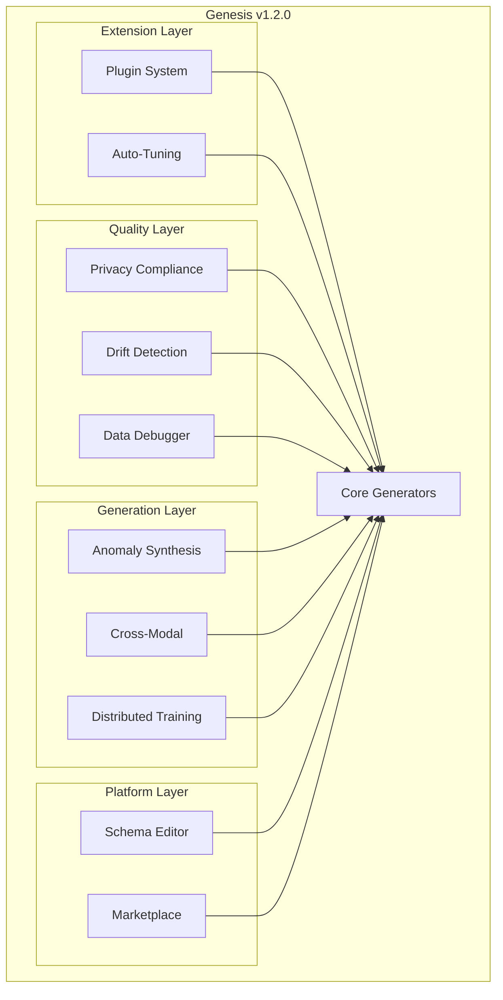

# v1.2.0 API Reference

This document covers the 10 new modules added in Genesis v1.2.0.

## Table of Contents

- [Plugin System](#plugin-system)
- [Auto-Tuning](#auto-tuning)
- [Privacy Compliance](#privacy-compliance)
- [Drift Detection](#drift-detection)
- [Synthetic Debugger](#synthetic-debugger)
- [Anomaly Synthesis](#anomaly-synthesis)
- [Distributed Training](#distributed-training)
- [Cross-Modal Generation](#cross-modal-generation)
- [Schema Editor](#schema-editor)
- [Marketplace](#marketplace)

---

## Plugin System

**Module:** `genesis.plugins`

Decorator-based plugin system for extending Genesis with custom components.

### Quick Start

```python
from genesis.plugins import register_generator, get_generator, list_generators

# Register a custom generator
@register_generator("my_ctgan", description="Custom CTGAN variant")
class MyCTGAN(BaseGenerator):
    def _fit_impl(self, data, discrete_columns, progress_callback):
        # Custom fitting logic
        pass
    
    def _generate_impl(self, n_samples, conditions, progress_callback):
        # Custom generation logic
        pass

# Use it
gen = get_generator("my_ctgan")()
gen.fit(data)
synthetic = gen.generate(1000)
```

### Classes

#### `PluginRegistry`

Central registry for all Genesis plugins (singleton pattern).

```python
from genesis.plugins import get_registry

registry = get_registry()
registry.register("my_plugin", MyClass, PluginType.GENERATOR)
registry.get("my_plugin", PluginType.GENERATOR)
registry.list_plugins(PluginType.GENERATOR)
registry.unregister("my_plugin", PluginType.GENERATOR)
```

#### `PluginInfo`

Metadata about a registered plugin.

| Attribute | Type | Description |
|-----------|------|-------------|
| `name` | str | Plugin name |
| `plugin_type` | PluginType | Type of plugin |
| `cls` | Type | The plugin class |
| `description` | str | Human-readable description |
| `version` | str | Plugin version |
| `author` | str | Plugin author |
| `tags` | List[str] | Searchable tags |

### Decorators

| Decorator | Description |
|-----------|-------------|
| `@register_generator(name, **kwargs)` | Register a generator class |
| `@register_transformer(name, **kwargs)` | Register a transformer class |
| `@register_evaluator(name, **kwargs)` | Register an evaluator class |
| `@register_constraint(name, **kwargs)` | Register a constraint class |
| `@register_callback(name, **kwargs)` | Register a callback class |

### Functions

| Function | Description |
|----------|-------------|
| `get_generator(name)` | Get registered generator by name |
| `get_transformer(name)` | Get registered transformer by name |
| `list_generators()` | List all registered generators |
| `discover_plugins(package)` | Auto-discover plugins in package |

---

## Auto-Tuning

**Module:** `genesis.tuning`

Automatic hyperparameter optimization using Optuna or built-in random search.

### Quick Start

```python
from genesis.tuning import AutoTuner, TuningPreset

# Basic usage
tuner = AutoTuner(method='ctgan')
result = tuner.tune(data, n_trials=20)

# Use preset for convenience
tuner = AutoTuner.from_preset(TuningPreset.QUALITY)
result = tuner.tune(data)

# Apply result
from genesis import SyntheticGenerator
gen = SyntheticGenerator(config=result.best_config)
```

### Classes

#### `AutoTuner`

Main class for hyperparameter optimization.

```python
tuner = AutoTuner(
    method='ctgan',           # Generator method
    config=TuningConfig(),    # Tuning configuration
    metric='statistical_fidelity'  # Optimization target
)

result = tuner.tune(
    data=df,
    discrete_columns=['category'],
    n_trials=30,
    timeout=600  # seconds
)
```

#### `TuningConfig`

Configuration for the tuning process.

| Parameter | Type | Default | Description |
|-----------|------|---------|-------------|
| `n_trials` | int | 20 | Number of optimization trials |
| `timeout` | float | None | Max seconds for optimization |
| `n_jobs` | int | 1 | Parallel trials |
| `preset` | TuningPreset | BALANCED | Speed/quality tradeoff |
| `validation_split` | float | 0.2 | Holdout for evaluation |
| `metric` | str | "statistical_fidelity" | Target metric |
| `early_stopping_rounds` | int | 5 | Stop if no improvement |

#### `TuningResult`

Result of hyperparameter tuning.

| Attribute | Type | Description |
|-----------|------|-------------|
| `best_config` | GeneratorConfig | Optimized configuration |
| `best_score` | float | Best metric score achieved |
| `n_trials` | int | Trials completed |
| `total_time` | float | Total tuning time (seconds) |
| `trials_history` | List[Dict] | All trial results |

### Presets

| Preset | Trials | Timeout | Use Case |
|--------|--------|---------|----------|
| `FAST` | 10 | 5 min | Quick experiments |
| `BALANCED` | 20 | 10 min | Default choice |
| `QUALITY` | 50 | 30 min | Production models |

---

## Privacy Compliance

**Module:** `genesis.compliance`

Generate privacy compliance certificates for GDPR, HIPAA, and CCPA.

### Quick Start

```python
from genesis.compliance import PrivacyCertificate, ComplianceFramework

cert = PrivacyCertificate(real_data, synthetic_data)
report = cert.generate(framework=ComplianceFramework.GDPR)

# Export
report.to_html("privacy_report.html")
report.to_json("privacy_report.json")
report.to_markdown("privacy_report.md")

print(f"Compliant: {report.is_compliant}")
print(f"Overall Risk: {report.overall_risk_level}")
```

### Classes

#### `PrivacyCertificate`

Generates privacy compliance reports.

```python
cert = PrivacyCertificate(
    real_data=df_real,
    synthetic_data=df_synthetic,
    sensitive_columns=['ssn', 'dob'],
    quasi_identifiers=['zipcode', 'age', 'gender']
)
```

#### `PrivacyCertificateReport`

The generated compliance report.

| Attribute | Type | Description |
|-----------|------|-------------|
| `is_compliant` | bool | Meets framework requirements |
| `overall_risk_level` | RiskLevel | NEGLIGIBLE/LOW/MEDIUM/HIGH/CRITICAL |
| `metrics` | List[PrivacyMetric] | Individual metric results |
| `framework` | ComplianceFramework | Which framework was evaluated |
| `recommendations` | List[str] | Improvement suggestions |

### Frameworks

| Framework | Key Requirements |
|-----------|-----------------|
| `GDPR` | EU data protection, right to erasure |
| `HIPAA` | US healthcare data protection |
| `CCPA` | California consumer privacy |
| `GENERAL` | Basic privacy best practices |

### Metrics Evaluated

- Re-identification risk
- Membership inference attack resistance
- Attribute disclosure risk
- Distance to closest record
- K-anonymity
- L-diversity

---

## Drift Detection

**Module:** `genesis.monitoring`

Monitor data drift between real and synthetic data over time.

### Quick Start

```python
from genesis.monitoring import DriftDetector, DriftMonitor

# One-time check
detector = DriftDetector(reference_data=baseline_df)
report = detector.check(current_data=new_df)

if report.has_drift:
    print(f"Drift detected in: {report.drifted_columns}")

# Continuous monitoring
monitor = DriftMonitor(
    reference_data=baseline_df,
    check_interval=3600,  # hourly
    alert_handlers=[LoggingHandler(), WebhookHandler(url)]
)
monitor.start()
```

### Classes

#### `DriftDetector`

Detects distribution drift between datasets.

```python
detector = DriftDetector(
    reference_data=df,
    drift_threshold=0.05,      # p-value threshold
    methods=['ks_test', 'js_divergence']
)

report = detector.check(
    current_data=new_df,
    columns=['age', 'income', 'category']
)
```

#### `DriftReport`

Results of drift detection.

| Attribute | Type | Description |
|-----------|------|-------------|
| `has_drift` | bool | Any column drifted |
| `drift_score` | float | Aggregate drift score |
| `drifted_columns` | List[str] | Columns with detected drift |
| `column_reports` | Dict | Per-column statistics |
| `drift_type` | DriftType | DATA/CONCEPT/QUALITY |

#### `DriftMonitor`

Continuous monitoring with alerting.

```python
from genesis.monitoring import (
    DriftMonitor, 
    LoggingHandler,
    WebhookHandler,
    CallbackHandler
)

monitor = DriftMonitor(
    reference_data=baseline,
    check_interval=3600,
    alert_handlers=[
        LoggingHandler(),
        WebhookHandler("https://alerts.example.com/webhook"),
        CallbackHandler(lambda report: send_email(report))
    ]
)
```

---

## Synthetic Debugger

**Module:** `genesis.debugger`

Debug quality issues in synthetic data.

### Quick Start

```python
from genesis.debugger import SyntheticDebugger

debugger = SyntheticDebugger(real_data, synthetic_data)
diagnosis = debugger.diagnose()

# Get specific issues
for issue in diagnosis.issues:
    print(f"{issue.severity}: {issue.column} - {issue.description}")
    print(f"  Suggestion: {issue.suggestion}")

# Compare specific columns
comparison = debugger.compare_column('age')
print(comparison.to_markdown())
```

### Classes

#### `SyntheticDebugger`

Main debugging interface.

```python
debugger = SyntheticDebugger(
    real_data=df_real,
    synthetic_data=df_synthetic,
    config=DebuggerConfig(
        distribution_threshold=0.1,
        correlation_threshold=0.2,
        outlier_threshold=3.0
    )
)
```

**Methods:**

| Method | Description |
|--------|-------------|
| `diagnose()` | Full diagnostic report |
| `compare_column(col)` | Compare single column |
| `compare_correlations()` | Compare correlation matrices |
| `find_outliers()` | Find synthetic outliers |
| `suggest_improvements()` | Get actionable suggestions |

#### `DiagnosisReport`

Comprehensive diagnosis results.

| Attribute | Type | Description |
|-----------|------|-------------|
| `issues` | List[Issue] | Detected quality issues |
| `column_scores` | Dict[str, float] | Per-column quality scores |
| `overall_score` | float | Aggregate quality (0-1) |
| `suggestions` | List[str] | Improvement recommendations |

---

## Anomaly Synthesis

**Module:** `genesis.anomaly`

Generate synthetic anomalies for ML training.

### Quick Start

```python
from genesis.anomaly import AnomalyGenerator, AnomalyType

gen = AnomalyGenerator(normal_data)

# Generate statistical anomalies
anomalies = gen.generate(
    n_samples=100,
    anomaly_type=AnomalyType.STATISTICAL,
    magnitude=3.0  # Standard deviations
)

# Generate fraud-like anomalies
from genesis.anomaly import AnomalyProfile
fraud_anomalies = gen.generate(
    n_samples=50,
    profile=AnomalyProfile.FRAUD
)

# Create balanced dataset
from genesis.anomaly import BalancedDatasetGenerator
balanced = BalancedDatasetGenerator(data, label_column='fraud')
augmented = balanced.generate(target_ratio=0.3)
```

### Classes

#### `AnomalyGenerator`

Generate synthetic anomalies.

```python
gen = AnomalyGenerator(
    normal_data=df,
    columns=['amount', 'frequency'],
    seed=42
)

anomalies = gen.generate(
    n_samples=100,
    anomaly_type=AnomalyType.POINT,
    magnitude=2.5,
    blend_ratio=0.3  # Blend with normal patterns
)
```

### Anomaly Types

| Type | Description |
|------|-------------|
| `STATISTICAL` | Values beyond normal distribution |
| `POINT` | Individual outlier points |
| `CONTEXTUAL` | Normal values in wrong context |
| `COLLECTIVE` | Groups that are anomalous together |
| `ADVERSARIAL` | Designed to evade detection |

### Anomaly Profiles

| Profile | Use Case |
|---------|----------|
| `FRAUD` | Financial fraud patterns |
| `INTRUSION` | Network intrusion detection |
| `EQUIPMENT_FAILURE` | Predictive maintenance |
| `CUSTOM` | User-defined patterns |

---

## Distributed Training

**Module:** `genesis.distributed`

Train generators across multiple machines or GPUs.

### Quick Start

```python
from genesis.distributed import DistributedTrainer, DistributedConfig

trainer = DistributedTrainer(
    config=DistributedConfig(
        backend='ray',
        n_workers=4,
        use_gpu=True
    )
)

# Distributed fit
trainer.fit(data, method='ctgan')

# Generate (runs on single node)
synthetic = trainer.generate(10000)
```

### Classes

#### `DistributedTrainer`

Orchestrates distributed training.

```python
from genesis.distributed import DistributedTrainer

trainer = DistributedTrainer(
    config=DistributedConfig(
        backend='ray',      # 'ray', 'dask', 'multiprocessing'
        n_workers=8,
        use_gpu=True,
        gpu_ids=[0, 1, 2, 3]
    )
)
```

#### `DistributedConfig`

Configuration for distributed training.

| Parameter | Type | Default | Description |
|-----------|------|---------|-------------|
| `backend` | str | 'multiprocessing' | Backend framework |
| `n_workers` | int | 4 | Number of workers |
| `use_gpu` | bool | False | Enable GPU training |
| `gpu_ids` | List[int] | None | Specific GPUs to use |
| `memory_limit` | str | None | Per-worker memory limit |

### Backends

| Backend | Requirements | Best For |
|---------|--------------|----------|
| `multiprocessing` | None | Single machine, CPU |
| `ray` | `pip install ray` | Multi-node clusters |
| `dask` | `pip install dask distributed` | Large datasets |

---

## Cross-Modal Generation

**Module:** `genesis.crossmodal`

Generate paired multi-modal data (tabular + text).

### Quick Start

```python
from genesis.crossmodal import CrossModalGenerator, TabularTextGenerator

# Generate tabular data with matching descriptions
gen = TabularTextGenerator(
    tabular_data=df,
    text_column='description'
)
gen.fit()

# Generate paired data
result = gen.generate(100)
print(result['tabular'])  # DataFrame
print(result['text'])     # List of descriptions
```

### Classes

#### `CrossModalGenerator`

Base class for cross-modal generation.

```python
gen = CrossModalGenerator(
    modalities=['tabular', 'text'],
    latent_dim=128,
    alignment_weight=0.5
)
```

#### `TabularTextGenerator`

Specialized generator for tabular + text pairs.

```python
gen = TabularTextGenerator(
    tabular_data=df,
    text_column='description',
    template="Product: {name}, Price: ${price}, {description}"
)

gen.fit()
pairs = gen.generate(
    n_samples=100,
    temperature=0.7  # Text generation creativity
)
```

---

## Schema Editor

**Module:** `genesis.schema_editor`

Backend for visual schema editing.

### Quick Start

```python
from genesis.schema_editor import SchemaDefinition, SchemaEditorAPI

# Infer schema from data
schema = SchemaDefinition.from_dataframe(df)

# Edit programmatically
schema.columns['age'].min_value = 18
schema.columns['age'].max_value = 120
schema.add_constraint('age', 'range', min=18, max=120)

# Export
print(schema.to_python_code())
schema.to_yaml('schema.yaml')

# Use with API backend
api = SchemaEditorAPI()
api.create_schema('customers', schema)
```

### Classes

#### `SchemaDefinition`

Define data schema with constraints.

```python
from genesis.schema_editor import SchemaDefinition, ColumnDefinition

schema = SchemaDefinition(
    name='customers',
    columns={
        'id': ColumnDefinition(dtype='int', primary_key=True),
        'name': ColumnDefinition(dtype='str', nullable=False),
        'age': ColumnDefinition(dtype='int', min_value=0, max_value=150),
        'email': ColumnDefinition(dtype='str', pattern=r'.*@.*\..*'),
    }
)
```

#### `ColumnDefinition`

Define column constraints.

| Attribute | Type | Description |
|-----------|------|-------------|
| `dtype` | str | Data type (int, float, str, datetime, bool) |
| `nullable` | bool | Allow null values |
| `min_value` | Any | Minimum value |
| `max_value` | Any | Maximum value |
| `pattern` | str | Regex pattern (strings) |
| `categories` | List | Allowed values (categorical) |
| `distribution` | str | Statistical distribution |

---

## Marketplace

**Module:** `genesis.marketplace`

Backend for synthetic data marketplace.

### Quick Start

```python
from genesis.marketplace import Marketplace, DatasetListing

# Initialize marketplace
market = Marketplace(storage_path='./marketplace')

# Create a listing
listing = DatasetListing(
    name='Customer Demographics',
    description='Synthetic customer data for ML training',
    schema=schema,
    n_samples=10000,
    price=0.0,  # Free
    license='MIT',
    tags=['customers', 'demographics', 'tabular']
)

# Add to marketplace
market.create_listing(listing, data=synthetic_df)

# Search
results = market.search(
    query='customers',
    tags=['tabular'],
    min_samples=5000
)

# Download
data = market.download(listing_id='abc123')
```

### Classes

#### `Marketplace`

Main marketplace interface.

```python
market = Marketplace(
    storage_path='./marketplace',
    enable_validation=True,
    enable_provenance=True
)
```

**Methods:**

| Method | Description |
|--------|-------------|
| `create_listing(listing, data)` | Add dataset to marketplace |
| `search(query, **filters)` | Search listings |
| `get_listing(id)` | Get listing details |
| `download(id)` | Download dataset |
| `add_review(id, rating, comment)` | Add user review |

#### `DatasetListing`

Metadata for a marketplace listing.

| Attribute | Type | Description |
|-----------|------|-------------|
| `name` | str | Dataset name |
| `description` | str | Full description |
| `schema` | SchemaDefinition | Data schema |
| `n_samples` | int | Number of samples |
| `columns` | List[str] | Column names |
| `price` | float | Price (0 for free) |
| `license` | str | Data license |
| `tags` | List[str] | Searchable tags |
| `quality_score` | float | Quality metric (0-1) |
| `provenance` | Dict | Generation metadata |

---

## Architecture Overview



---

## See Also

- [Core API Reference](reference.md)
- [Tabular Generation Guide](../user_guide/tabular.md)
- [Privacy Configuration](../user_guide/privacy.md)
- [Architecture Decision Records](../adr/README.md)
