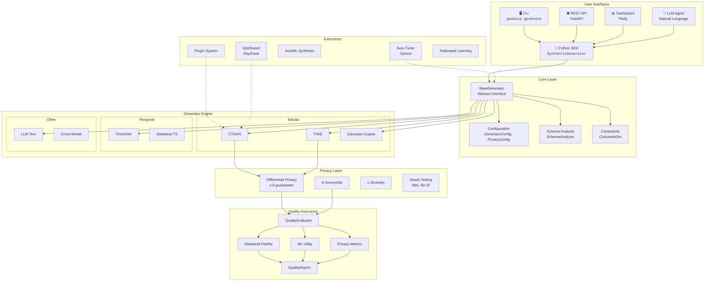
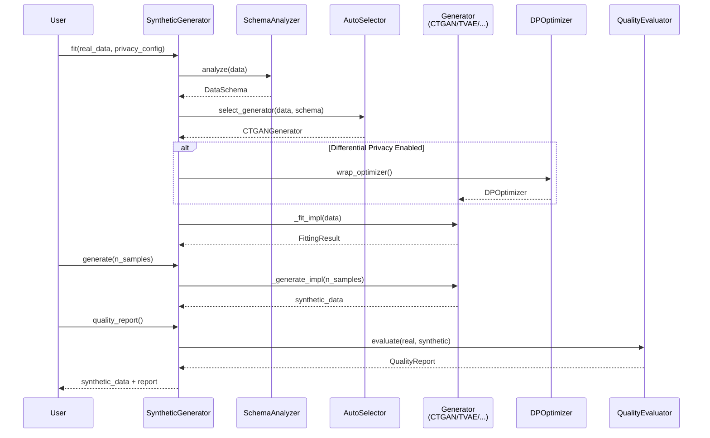
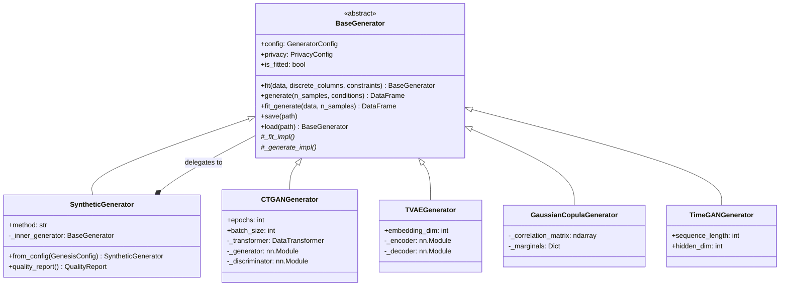
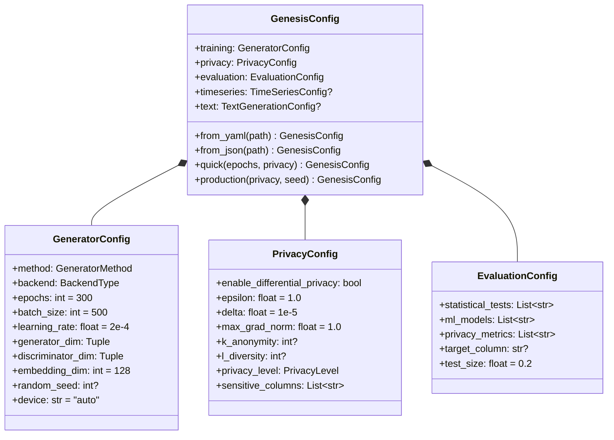
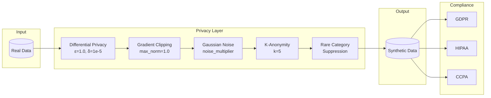
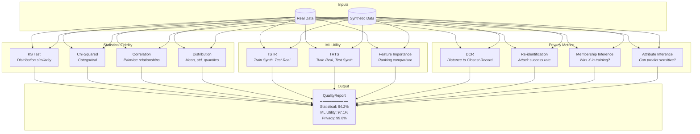
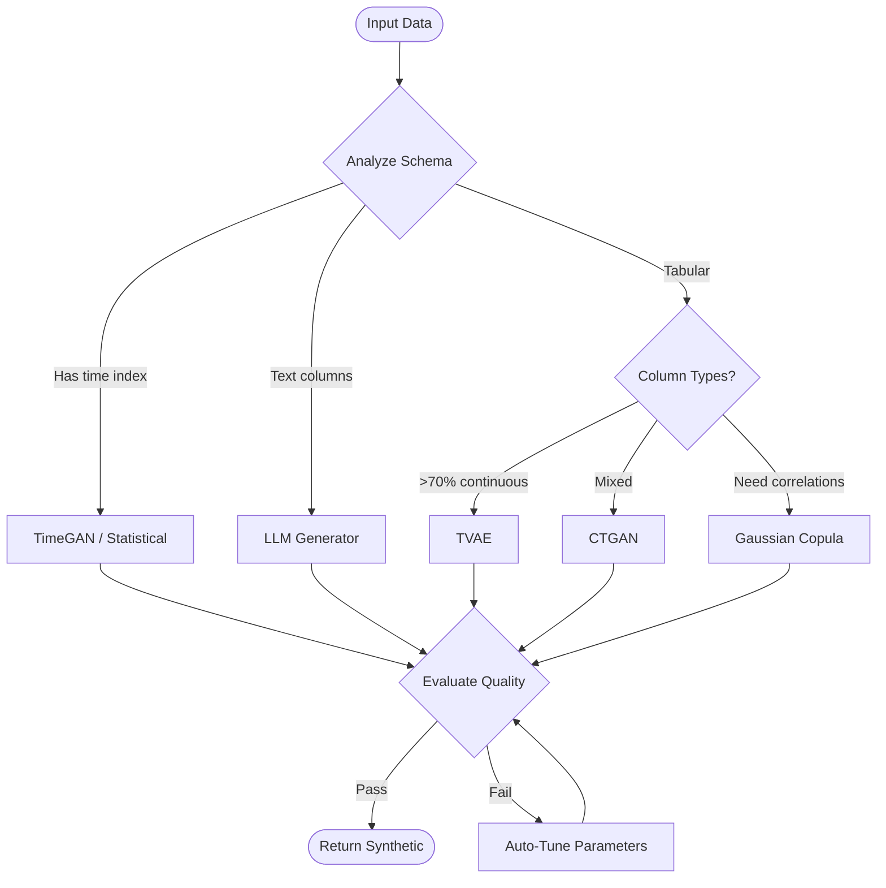
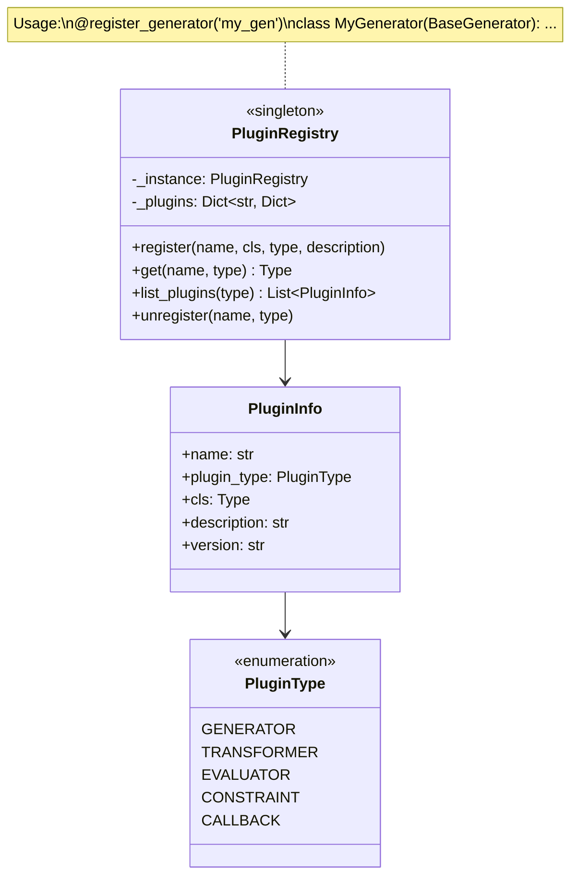
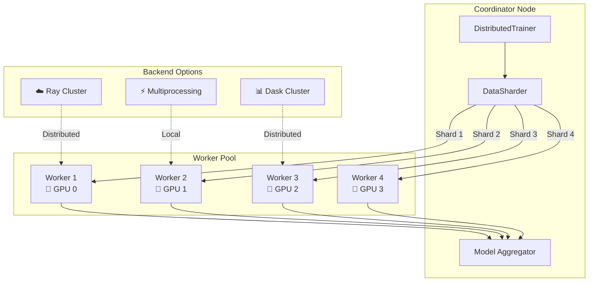
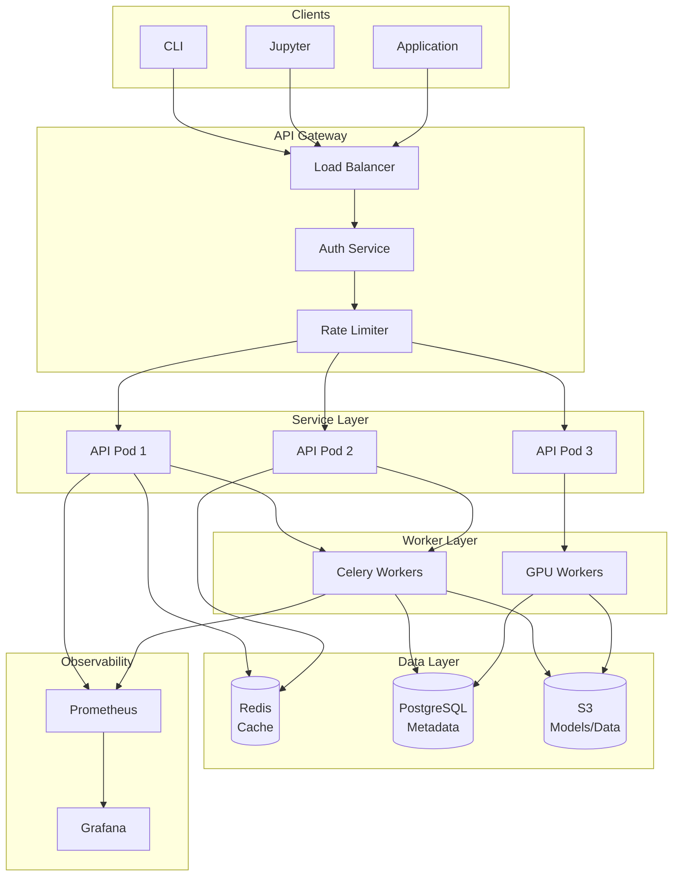

# Genesis Architecture Documentation

## Overview

**Genesis** is a comprehensive synthetic data generation platform that creates realistic, privacy-safe data for ML training, testing, and development. It follows a modular, extensible architecture designed around privacy-first principles.

---

## Project Summary

| Aspect | Details |
|--------|---------|
| **Language** | Python 3.8+ |
| **Package** | `genesis-synth` |
| **License** | MIT |
| **Core Purpose** | Generate privacy-preserving synthetic data for ML/testing |

### Key Capabilities
- **Data Types**: Tabular, time series, text, cross-modal
- **Privacy**: Differential privacy, k-anonymity, l-diversity
- **Quality**: Statistical fidelity, ML utility preservation
- **Scale**: Distributed training via Ray/Dask, GPU acceleration

---

## High-Level Architecture



---

## Module Structure

```
genesis/
├── core/                    # Foundation layer
│   ├── base.py             # BaseGenerator, SyntheticGenerator
│   ├── config.py           # GeneratorConfig, PrivacyConfig, GenesisConfig
│   ├── constraints.py      # Constraint, ConstraintSet
│   ├── types.py            # Enums, type definitions
│   ├── exceptions.py       # Custom exceptions
│   └── mixins.py           # Generator extension capabilities
│
├── generators/              # Data generation algorithms
│   ├── tabular/            # CTGAN, TVAE, GaussianCopula
│   ├── timeseries/         # TimeGAN, Statistical methods
│   ├── text/               # LLM-based generation
│   ├── image/              # Diffusion models
│   ├── conditional/        # Conditional sampling
│   └── auto.py             # Auto-selection logic
│
├── evaluation/              # Quality assessment
│   ├── evaluator.py        # QualityEvaluator
│   ├── statistical.py      # Distribution tests
│   ├── ml_utility.py       # Train-on-synthetic metrics
│   ├── privacy.py          # Re-identification risk
│   └── report.py           # QualityReport
│
├── privacy/                 # Privacy protection
│   ├── differential.py     # DP-SGD, noise mechanisms
│   ├── anonymity.py        # K-anonymity, L-diversity
│   └── metrics.py          # Privacy measurement
│
├── plugins.py               # Plugin registry system
├── tuning.py                # Hyperparameter optimization
├── automl.py                # Automatic method selection
├── distributed.py           # Ray/Dask distributed training
├── federated.py             # Privacy-preserving distributed
├── streaming.py             # Kafka/WebSocket real-time
├── lineage.py               # Data provenance tracking
├── compliance.py            # GDPR/HIPAA certificates
├── drift.py                 # Distribution drift detection
├── versioning.py            # Dataset versioning
├── domains.py               # Healthcare/Finance generators
└── cli/                     # Command-line interface
```

---

## Core Data Flow



---

## Key Components

### 1. Generator Hierarchy



### 2. Configuration System



### 3. Privacy Architecture



### 4. Quality Evaluation Pipeline



---

## Generator Selection Logic

| Data Characteristics | Recommended Generator | Rationale |
|---------------------|----------------------|-----------|
| Mixed types (num + cat) | **CTGAN** | Conditional GAN handles mode collapse |
| Mostly continuous | **TVAE** | VAE better for smooth distributions |
| Need exact correlations | **Gaussian Copula** | Statistical method preserves correlations |
| Time series | **TimeGAN** | Captures temporal dependencies |
| Text generation | **LLM** | Transformer-based language models |
| Auto-select | **AutoML** | Analyzes data, benchmarks methods |



---

## Plugin Architecture



**Registration Example:**
```python
from genesis.plugins import register_generator

@register_generator("custom_gan", description="My custom GAN")
class CustomGANGenerator(BaseGenerator):
    def _fit_impl(self, data, discrete_columns, progress_callback):
        # Custom fitting logic
        pass
    
    def _generate_impl(self, n_samples, conditions, progress_callback):
        # Custom generation logic
        return synthetic_df
```

---

## Distributed Training



---

## Deployment Architecture



---

## Technology Stack

| Layer | Technologies |
|-------|-------------|
| **Language** | Python 3.8+ |
| **ML Frameworks** | PyTorch (primary), TensorFlow (optional) |
| **Data** | Pandas, NumPy, SciPy |
| **ML Libraries** | scikit-learn, SDV |
| **Optimization** | Optuna (hyperparameter tuning) |
| **API** | FastAPI, Pydantic |
| **Distributed** | Ray, Dask |
| **Streaming** | Kafka, WebSocket |
| **Cache** | Redis |
| **Database** | PostgreSQL |
| **Monitoring** | Prometheus, Grafana |
| **Containers** | Docker, Kubernetes |

---

## API Quick Reference

### Basic Usage
```python
from genesis import SyntheticGenerator, PrivacyConfig

# Initialize with privacy
generator = SyntheticGenerator(
    method='auto',
    privacy=PrivacyConfig(
        enable_differential_privacy=True,
        epsilon=1.0
    )
)

# Fit and generate
generator.fit(real_data)
synthetic_data = generator.generate(n_samples=10000)

# Evaluate quality
report = generator.quality_report()
print(report.summary())
```

### CLI Commands
```bash
# Generate data
genesis generate -i data.csv -o synthetic.csv -m ctgan -n 10000

# AutoML selection
genesis automl -i data.csv -o synthetic.csv

# Privacy audit
genesis privacy-audit -r original.csv -s synthetic.csv --sensitive ssn,income

# Domain generation
genesis domain healthcare -t patient_cohort -n 1000 -o patients.csv
```

---

## Version Features Matrix

| Feature | v1.2 | v1.3 | v1.4 |
|---------|:----:|:----:|:----:|
| Plugin System | ✅ | ✅ | ✅ |
| Auto-Tuning | ✅ | ✅ | ✅ |
| Privacy Certificates | ✅ | ✅ | ✅ |
| Drift Detection | ✅ | ✅ | ✅ |
| Guided Conditional | | ✅ | ✅ |
| LLM Interface | | ✅ | ✅ |
| Streaming | | ✅ | ✅ |
| Federated Learning | | ✅ | ✅ |
| AutoML Synthesis | | | ✅ |
| Privacy Attack Testing | | | ✅ |
| Dataset Versioning | | | ✅ |
| GPU Acceleration | | | ✅ |
| Domain Generators | | | ✅ |

---

## Questions / Clarifications Needed

1. **Database Backend**: The architecture shows PostgreSQL but I don't see database integration code in the core modules. Is this planned for a future version or handled externally?

2. **Marketplace Backend**: The `marketplace.py` module exists but its integration with storage/authentication isn't documented. What's the current state?

3. **Image Generation**: The `generators/image/` directory exists but image generation isn't prominently featured. Is this experimental?

4. **Multi-Table Relationships**: The `multitable/` module handles relational schemas. Is there documentation on how foreign key relationships are preserved?

5. **Streaming Guarantees**: For Kafka streaming, what are the ordering and exactly-once delivery guarantees?
