# Genesis Architecture Documentation

## Overview

**Genesis** is a comprehensive synthetic data generation platform that creates realistic, privacy-safe data for ML training, testing, and development. It follows a modular, extensible architecture designed around privacy-first principles.

---

## Project Summary

| Aspect | Details |
|--------|---------|
| **Language** | Python 3.8+ |
| **Package** | `genesis-synth` |
| **License** | MIT |
| **Core Purpose** | Generate privacy-preserving synthetic data for ML/testing |

### Key Capabilities
- **Data Types**: Tabular, time series, text, cross-modal
- **Privacy**: Differential privacy, k-anonymity, l-diversity
- **Quality**: Statistical fidelity, ML utility preservation
- **Scale**: Distributed training via Ray/Dask, GPU acceleration

---

## High-Level Architecture

```mermaid
graph TB
    subgraph "User Interfaces"
        CLI["🖥️ CLI<br/><code>genesis generate</code>"]
        SDK["🐍 Python SDK<br/><code>SyntheticGenerator</code>"]
        API["🌐 REST API<br/>FastAPI"]
        DASH["📊 Dashboard<br/>Plotly"]
        AGENT["🤖 LLM Agent<br/>Natural Language"]
    end

    subgraph "Core Layer"
        direction TB
        BASE["BaseGenerator<br/><i>Abstract Interface</i>"]
        CONFIG["Configuration<br/><i>GeneratorConfig, PrivacyConfig</i>"]
        SCHEMA["Schema Analysis<br/><i>SchemaAnalyzer</i>"]
        CONST["Constraints<br/><i>ConstraintSet</i>"]
    end

    subgraph "Generator Engine"
        direction LR
        subgraph "Tabular"
            CTGAN["CTGAN"]
            TVAE["TVAE"]
            GC["Gaussian Copula"]
        end
        subgraph "Temporal"
            TGAN["TimeGAN"]
            STAT["Statistical TS"]
        end
        subgraph "Other"
            LLM["LLM Text"]
            CROSS["Cross-Modal"]
        end
    end

    subgraph "Privacy Layer"
        DP["Differential Privacy<br/><i>ε-δ guarantees</i>"]
        KANON["K-Anonymity"]
        LDIV["L-Diversity"]
        ATTACKS["Attack Testing<br/><i>MIA, Re-ID</i>"]
    end

    subgraph "Quality Assurance"
        EVAL["QualityEvaluator"]
        STAT_M["Statistical Fidelity"]
        ML_U["ML Utility"]
        PRIV_M["Privacy Metrics"]
        REPORT["QualityReport"]
    end

    subgraph "Extensions"
        PLUGIN["Plugin System"]
        TUNING["Auto-Tuner<br/><i>Optuna</i>"]
        AUTOML["AutoML Synthesis"]
        DIST["Distributed<br/><i>Ray/Dask</i>"]
        FED["Federated Learning"]
    end

    CLI --> SDK
    API --> SDK
    DASH --> SDK
    AGENT --> SDK
    
    SDK --> BASE
    BASE --> CONFIG
    BASE --> SCHEMA
    BASE --> CONST
    
    BASE --> CTGAN
    BASE --> TVAE
    BASE --> GC
    BASE --> TGAN
    BASE --> LLM
    
    CTGAN --> DP
    TVAE --> DP
    
    DP --> EVAL
    KANON --> EVAL
    
    EVAL --> STAT_M
    EVAL --> ML_U
    EVAL --> PRIV_M
    
    STAT_M --> REPORT
    ML_U --> REPORT
    PRIV_M --> REPORT
    
    PLUGIN -.-> CTGAN
    TUNING -.-> BASE
    DIST -.-> CTGAN
```



---

## Module Structure

```
genesis/
├── core/                    # Foundation layer
│   ├── base.py             # BaseGenerator, SyntheticGenerator
│   ├── config.py           # GeneratorConfig, PrivacyConfig, GenesisConfig
│   ├── constraints.py      # Constraint, ConstraintSet
│   ├── types.py            # Enums, type definitions
│   ├── exceptions.py       # Custom exceptions
│   └── mixins.py           # Generator extension capabilities
│
├── generators/              # Data generation algorithms
│   ├── tabular/            # CTGAN, TVAE, GaussianCopula
│   ├── timeseries/         # TimeGAN, Statistical methods
│   ├── text/               # LLM-based generation
│   ├── image/              # Diffusion models
│   ├── conditional/        # Conditional sampling
│   └── auto.py             # Auto-selection logic
│
├── evaluation/              # Quality assessment
│   ├── evaluator.py        # QualityEvaluator
│   ├── statistical.py      # Distribution tests
│   ├── ml_utility.py       # Train-on-synthetic metrics
│   ├── privacy.py          # Re-identification risk
│   └── report.py           # QualityReport
│
├── privacy/                 # Privacy protection
│   ├── differential.py     # DP-SGD, noise mechanisms
│   ├── anonymity.py        # K-anonymity, L-diversity
│   └── metrics.py          # Privacy measurement
│
├── plugins.py               # Plugin registry system
├── tuning.py                # Hyperparameter optimization
├── automl.py                # Automatic method selection
├── distributed.py           # Ray/Dask distributed training
├── federated.py             # Privacy-preserving distributed
├── streaming.py             # Kafka/WebSocket real-time
├── lineage.py               # Data provenance tracking
├── compliance.py            # GDPR/HIPAA certificates
├── drift.py                 # Distribution drift detection
├── versioning.py            # Dataset versioning
├── domains.py               # Healthcare/Finance generators
└── cli/                     # Command-line interface
```

---

## Core Data Flow


---

## Key Components

### 1. Generator Hierarchy


### 2. Configuration System


### 3. Privacy Architecture


### 4. Quality Evaluation Pipeline

```mermaid
flowchart TB
    subgraph Inputs
        REAL[(Real Data)]
        SYNTH[(Synthetic Data)]
    end
    
    subgraph "Statistical Fidelity"
        KS["KS Test<br/><i>Distribution similarity</i>"]
        CHI["Chi-Squared<br/><i>Categorical</i>"]
        CORR["Correlation<br/><i>Pairwise relationships</i>"]
        DIST["Distribution<br/><i>Mean, std, quantiles</i>"]
    end
    
    subgraph "ML Utility"
        TSTR["TSTR<br/><i>Train Synth, Test Real</i>"]
        TRTS["TRTS<br/><i>Train Real, Test Synth</i>"]
        FEAT["Feature Importance<br/><i>Ranking comparison</i>"]
    end
    
    subgraph "Privacy Metrics"
        DCR["DCR<br/><i>Distance to Closest Record</i>"]
        REID["Re-identification<br/><i>Attack success rate</i>"]
        MIA["Membership Inference<br/><i>Was X in training?</i>"]
        ATTR["Attribute Inference<br/><i>Can predict sensitive?</i>"]
    end
    
    subgraph Output
        REPORT["QualityReport<br/>━━━━━━━━━━━━<br/>Statistical: 94.2%<br/>ML Utility: 97.1%<br/>Privacy: 99.8%"]
    end
    
    REAL --> KS & CHI & CORR & DIST
    SYNTH --> KS & CHI & CORR & DIST
    
    REAL --> TSTR & TRTS & FEAT
    SYNTH --> TSTR & TRTS & FEAT
    
    REAL --> DCR & REID & MIA & ATTR
    SYNTH --> DCR & REID & MIA & ATTR
    
    KS & CHI & CORR & DIST --> REPORT
    TSTR & TRTS & FEAT --> REPORT
    DCR & REID & MIA & ATTR --> REPORT
```



---

## Generator Selection Logic

| Data Characteristics | Recommended Generator | Rationale |
|---------------------|----------------------|-----------|
| Mixed types (num + cat) | **CTGAN** | Conditional GAN handles mode collapse |
| Mostly continuous | **TVAE** | VAE better for smooth distributions |
| Need exact correlations | **Gaussian Copula** | Statistical method preserves correlations |
| Time series | **TimeGAN** | Captures temporal dependencies |
| Text generation | **LLM** | Transformer-based language models |
| Auto-select | **AutoML** | Analyzes data, benchmarks methods |


---

## Plugin Architecture


**Registration Example:**
```python
from genesis.plugins import register_generator

@register_generator("custom_gan", description="My custom GAN")
class CustomGANGenerator(BaseGenerator):
    def _fit_impl(self, data, discrete_columns, progress_callback):
        # Custom fitting logic
        pass
    
    def _generate_impl(self, n_samples, conditions, progress_callback):
        # Custom generation logic
        return synthetic_df
```

---

## Distributed Training

```mermaid
flowchart TB
    subgraph "Coordinator Node"
        TRAINER["DistributedTrainer"]
        SHARDER["DataSharder"]
        AGG["Model Aggregator"]
    end
    
    subgraph "Worker Pool"
        direction LR
        W1["Worker 1<br/>🔲 GPU 0"]
        W2["Worker 2<br/>🔲 GPU 1"]
        W3["Worker 3<br/>🔲 GPU 2"]
        W4["Worker 4<br/>🔲 GPU 3"]
    end
    
    subgraph "Backend Options"
        RAY["☁️ Ray Cluster"]
        DASK["📊 Dask Cluster"]
        MP["⚡ Multiprocessing"]
    end
    
    TRAINER --> SHARDER
    SHARDER --> |"Shard 1"| W1
    SHARDER --> |"Shard 2"| W2
    SHARDER --> |"Shard 3"| W3
    SHARDER --> |"Shard 4"| W4
    
    W1 --> AGG
    W2 --> AGG
    W3 --> AGG
    W4 --> AGG
    
    RAY -.->|"Distributed"| W1
    DASK -.->|"Distributed"| W3
    MP -.->|"Local"| W2
```



---

## Deployment Architecture


---

## Technology Stack

| Layer | Technologies |
|-------|-------------|
| **Language** | Python 3.8+ |
| **ML Frameworks** | PyTorch (primary), TensorFlow (optional) |
| **Data** | Pandas, NumPy, SciPy |
| **ML Libraries** | scikit-learn, SDV |
| **Optimization** | Optuna (hyperparameter tuning) |
| **API** | FastAPI, Pydantic |
| **Distributed** | Ray, Dask |
| **Streaming** | Kafka, WebSocket |
| **Cache** | Redis |
| **Database** | PostgreSQL |
| **Monitoring** | Prometheus, Grafana |
| **Containers** | Docker, Kubernetes |

---

## API Quick Reference

### Basic Usage
```python
from genesis import SyntheticGenerator, PrivacyConfig

# Initialize with privacy
generator = SyntheticGenerator(
    method='auto',
    privacy=PrivacyConfig(
        enable_differential_privacy=True,
        epsilon=1.0
    )
)

# Fit and generate
generator.fit(real_data)
synthetic_data = generator.generate(n_samples=10000)

# Evaluate quality
report = generator.quality_report()
print(report.summary())
```

### CLI Commands
```bash
# Generate data
genesis generate -i data.csv -o synthetic.csv -m ctgan -n 10000

# AutoML selection
genesis automl -i data.csv -o synthetic.csv

# Privacy audit
genesis privacy-audit -r original.csv -s synthetic.csv --sensitive ssn,income

# Domain generation
genesis domain healthcare -t patient_cohort -n 1000 -o patients.csv
```

---

## Version Features Matrix

| Feature | v1.2 | v1.3 | v1.4 |
|---------|:----:|:----:|:----:|
| Plugin System | ✅ | ✅ | ✅ |
| Auto-Tuning | ✅ | ✅ | ✅ |
| Privacy Certificates | ✅ | ✅ | ✅ |
| Drift Detection | ✅ | ✅ | ✅ |
| Guided Conditional | | ✅ | ✅ |
| LLM Interface | | ✅ | ✅ |
| Streaming | | ✅ | ✅ |
| Federated Learning | | ✅ | ✅ |
| AutoML Synthesis | | | ✅ |
| Privacy Attack Testing | | | ✅ |
| Dataset Versioning | | | ✅ |
| GPU Acceleration | | | ✅ |
| Domain Generators | | | ✅ |

---

## Questions / Clarifications Needed

1. **Database Backend**: The architecture shows PostgreSQL but I don't see database integration code in the core modules. Is this planned for a future version or handled externally?

2. **Marketplace Backend**: The `marketplace.py` module exists but its integration with storage/authentication isn't documented. What's the current state?

3. **Image Generation**: The `generators/image/` directory exists but image generation isn't prominently featured. Is this experimental?

4. **Multi-Table Relationships**: The `multitable/` module handles relational schemas. Is there documentation on how foreign key relationships are preserved?

5. **Streaming Guarantees**: For Kafka streaming, what are the ordering and exactly-once delivery guarantees?
