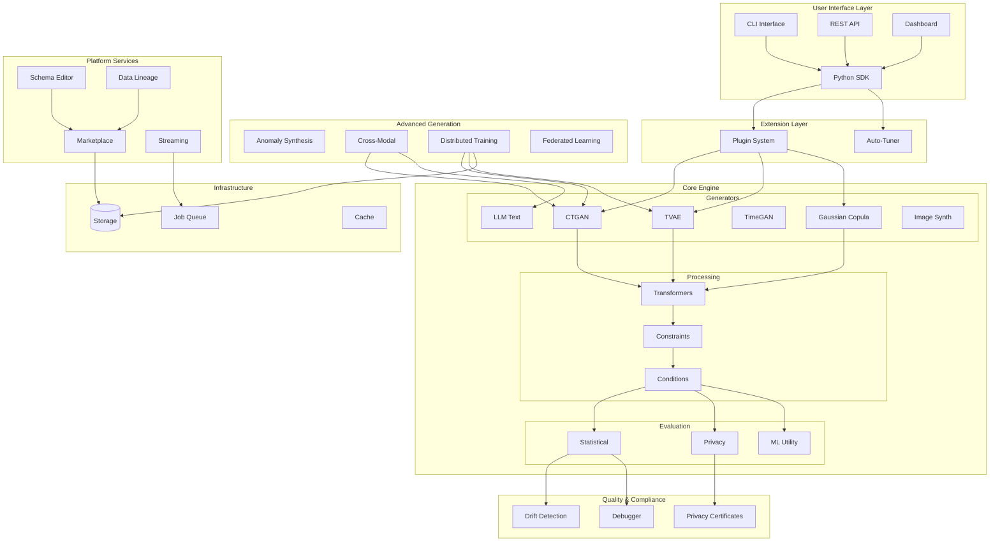
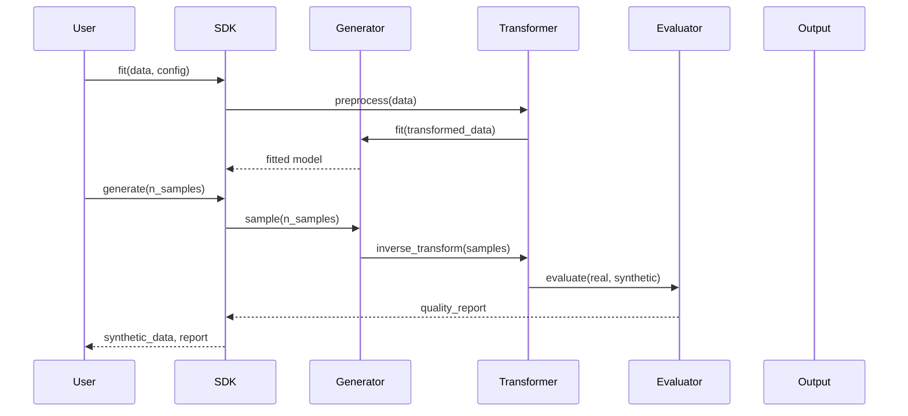
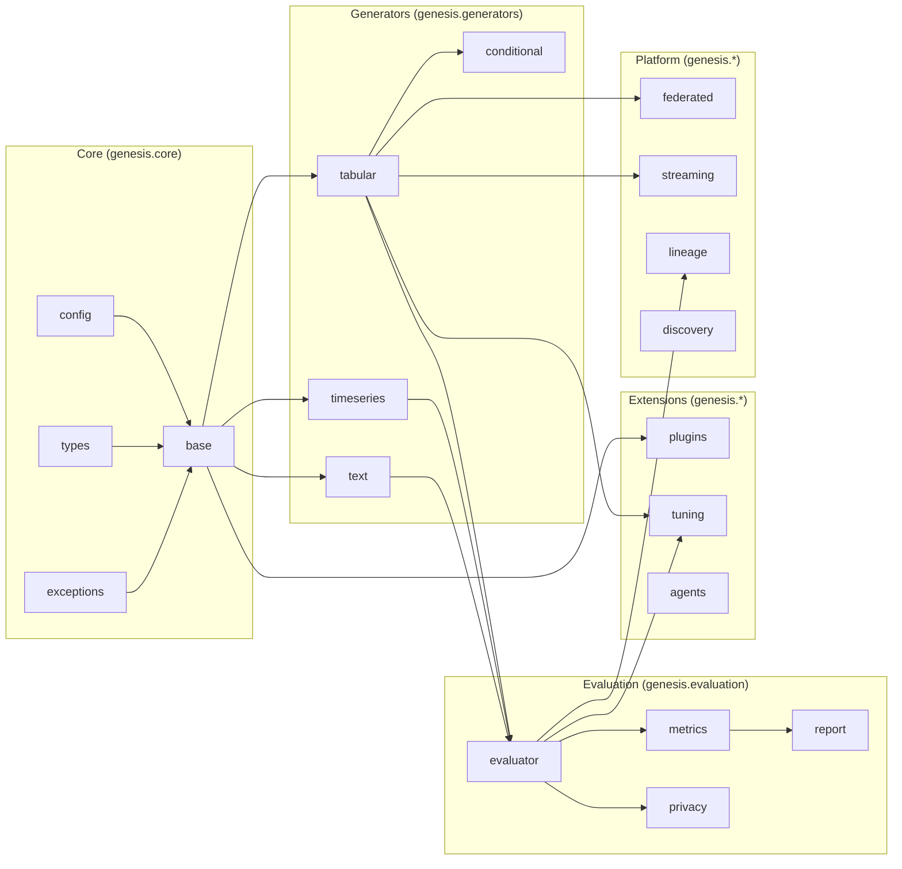
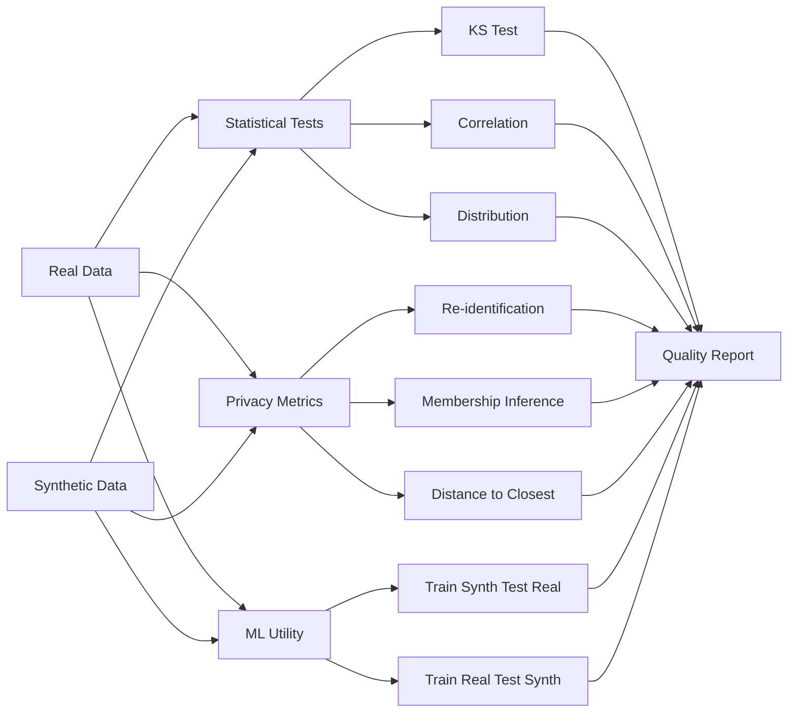
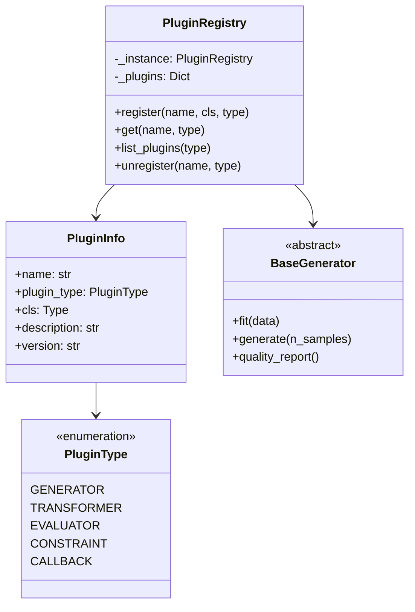
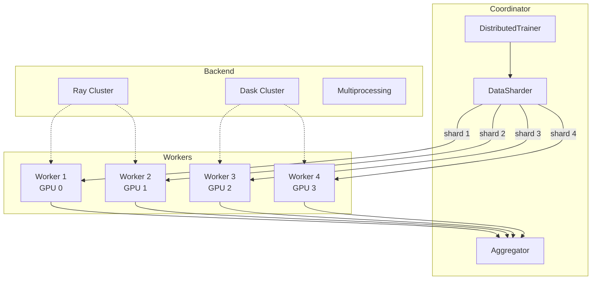
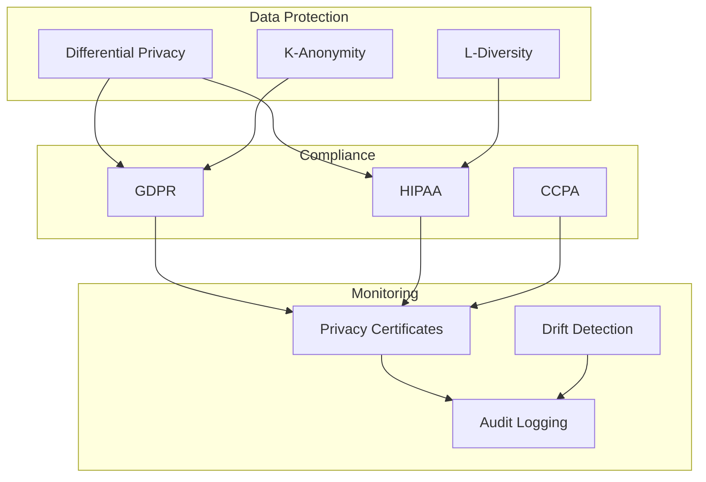
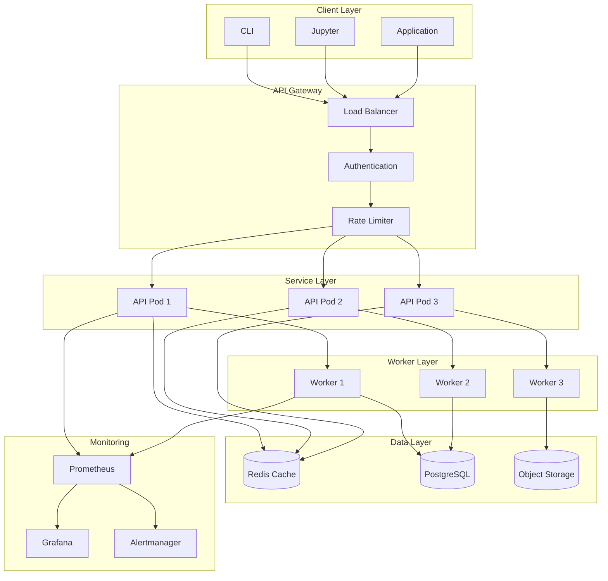

# Genesis Architecture Overview

This document provides a high-level architecture overview of the Genesis synthetic data generation platform.

## System Architecture

## Data Flow

## Module Dependency Graph

## Component Details

### Core Engine

The core engine provides the fundamental building blocks:

| Component | Purpose | Key Classes |
|-----------|---------|-------------|
| `base` | Abstract generator interface | `BaseGenerator`, `SyntheticGenerator` |
| `config` | Configuration management | `GeneratorConfig`, `PrivacyConfig` |
| `types` | Type definitions | `ColumnType`, `GeneratorMethod` |
| `constraints` | Data constraints | `Constraint`, `ConstraintSet` |

### Generators

Each generator implements a different synthesis algorithm:

| Generator | Algorithm | Best For |
|-----------|-----------|----------|
| `CTGANGenerator` | Conditional GAN | Mixed-type tabular |
| `TVAEGenerator` | Variational Autoencoder | Continuous-heavy data |
| `GaussianCopulaGenerator` | Copula modeling | Statistical fidelity |
| `TimeGANGenerator` | Temporal GAN | Time series |
| `LLMTextGenerator` | Large Language Model | Text generation |

### Evaluation Pipeline

### Plugin Architecture

### Distributed Training Architecture

## Security Model

## Deployment Architecture

## Technology Stack

| Layer | Technology |
|-------|------------|
| Language | Python 3.8+ |
| ML Framework | PyTorch, TensorFlow (optional) |
| Data Processing | Pandas, NumPy, SciPy |
| ML Libraries | scikit-learn, SDV |
| API Framework | FastAPI |
| Distributed | Ray, Dask |
| Caching | Redis |
| Database | PostgreSQL |
| Monitoring | Prometheus, Grafana |
| Container | Docker, Kubernetes |

## See Also

- [API Reference](../api/reference.md)
- [v1.2.0 Features](../api/v120_features.md)
- [v1.3.0 Features](../api/v130_features.md)
- [v1.4.0 Features](../api/v140_features.md)
- [Architecture Decision Records](../adr/README.md)
