# Genesis v1.3.0 Architecture

This document describes the architecture of the new features introduced in Genesis v1.3.0.

## Feature Overview

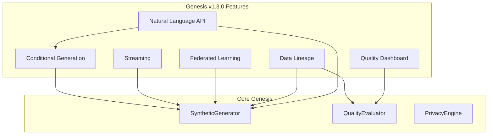

## Conditional Generation Architecture

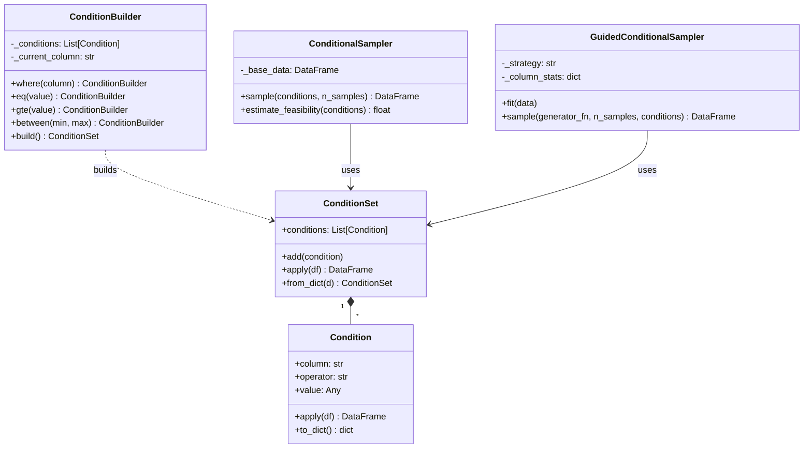

### Sampling Strategies

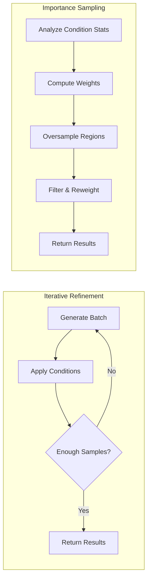

## Streaming Architecture

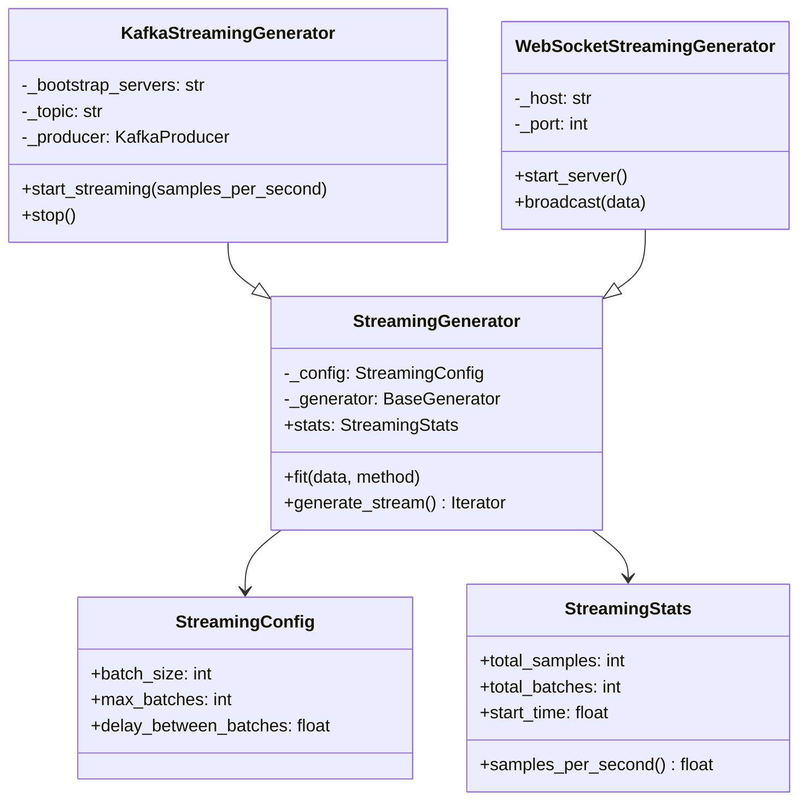

### Data Flow

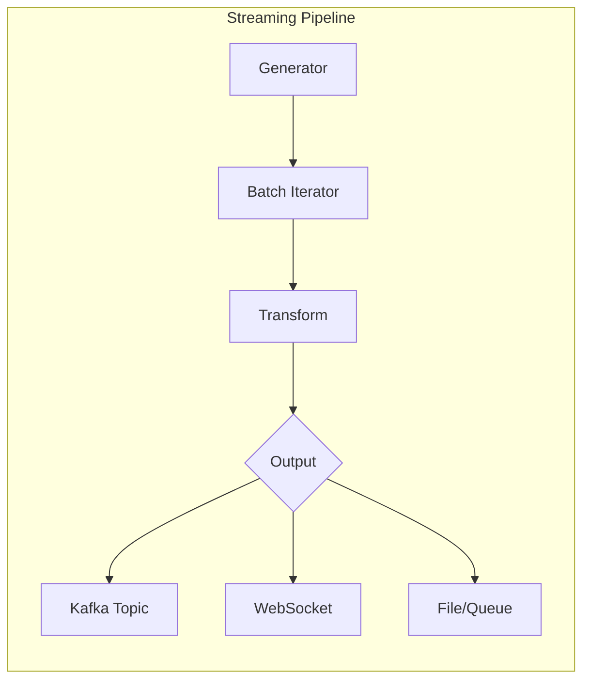

## Federated Learning Architecture

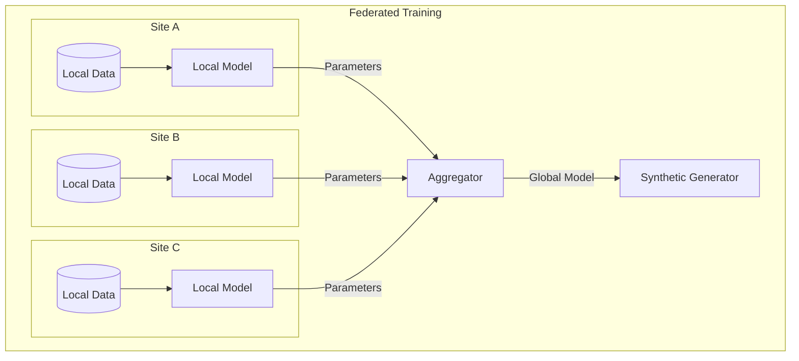

### Class Hierarchy

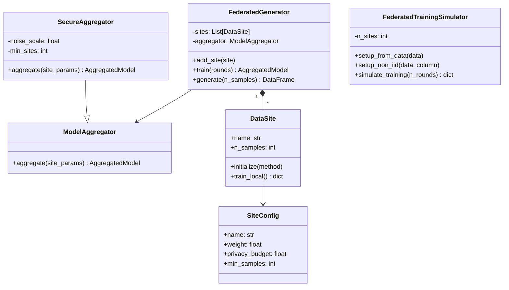

## Data Lineage Architecture

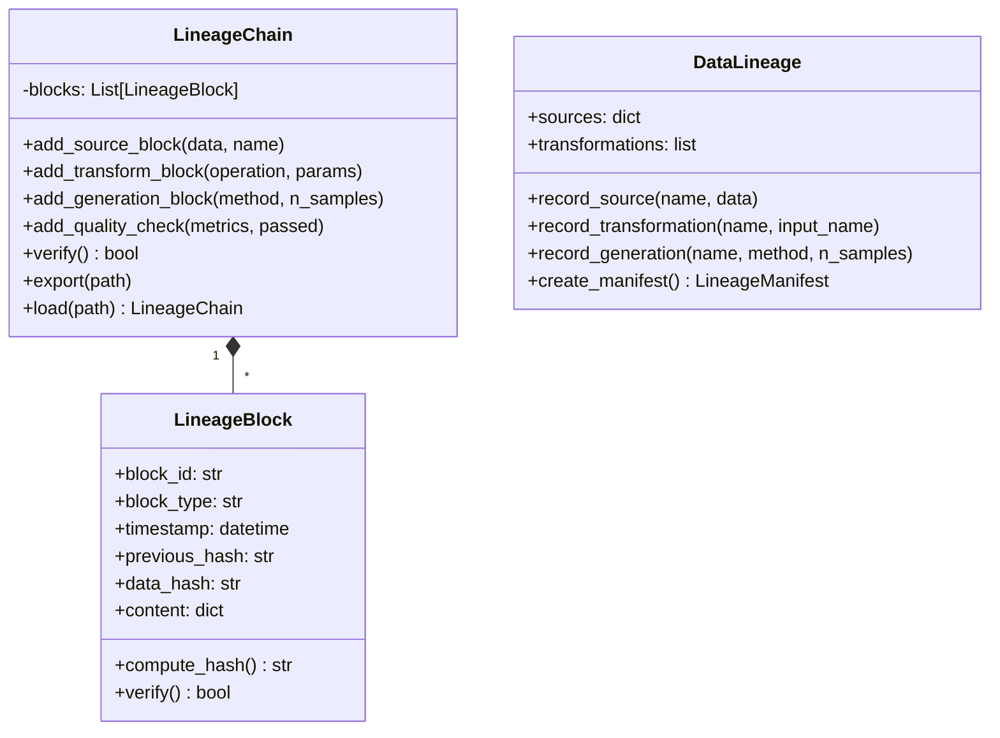

### Blockchain-Style Hash Chain

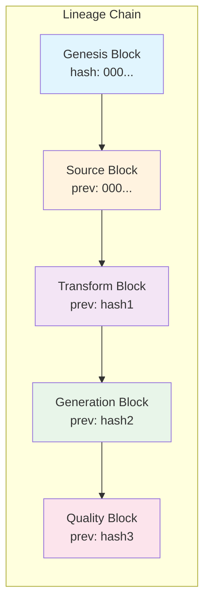

## Quality Dashboard Architecture

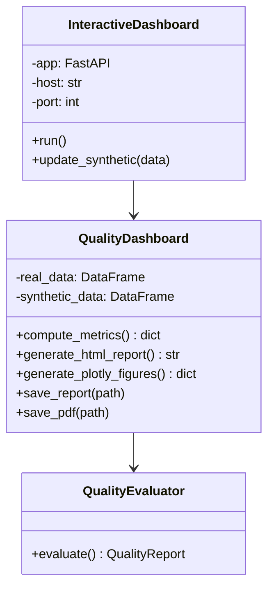

### Dashboard Components

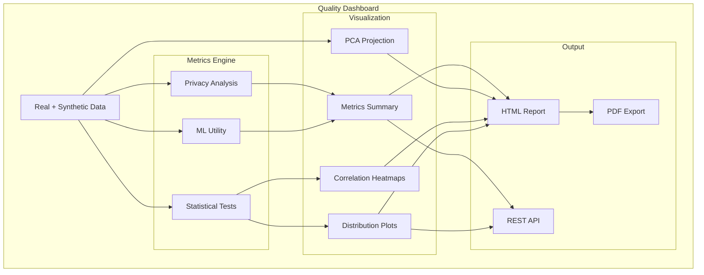

## Natural Language API Architecture

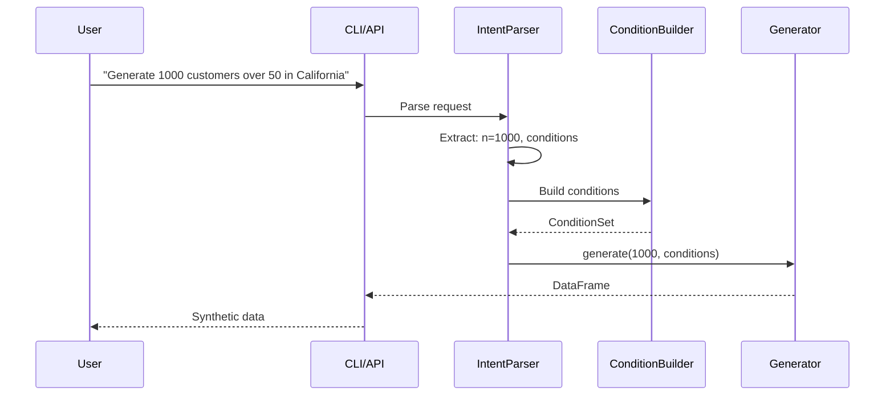

## Module Dependencies

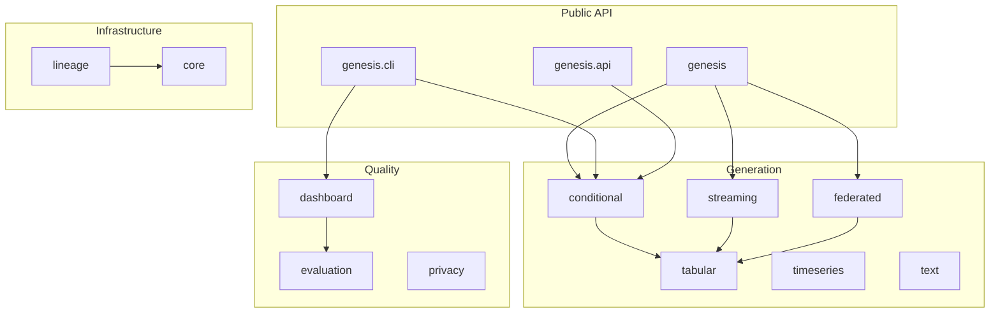

## Deployment Architecture

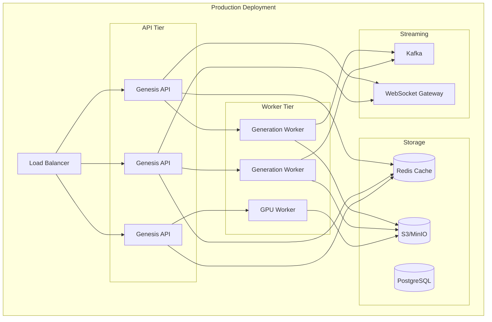

## Security Considerations

### Federated Learning Security

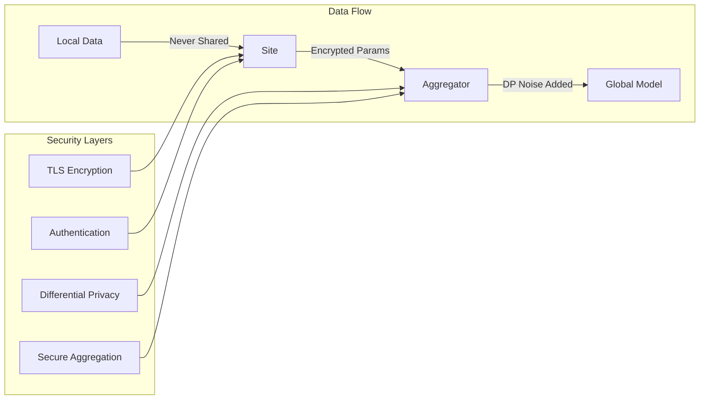

### Lineage Integrity

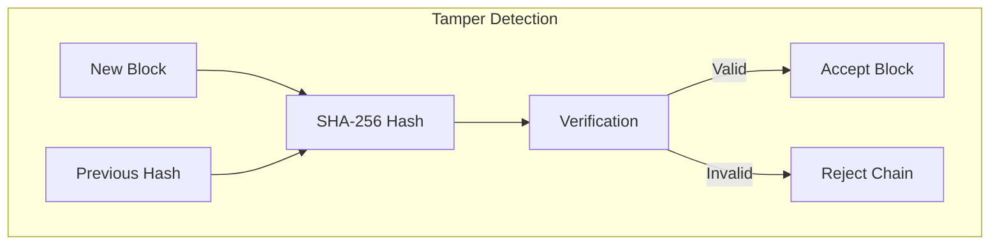
