# Genesis v1.4.0 Architecture

This document describes the architecture of the new features introduced in Genesis v1.4.0.

## Feature Overview

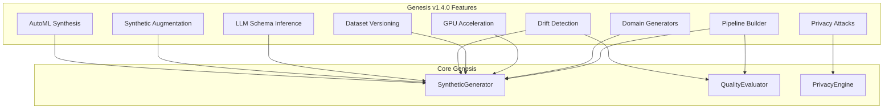

## AutoML Synthesis Architecture

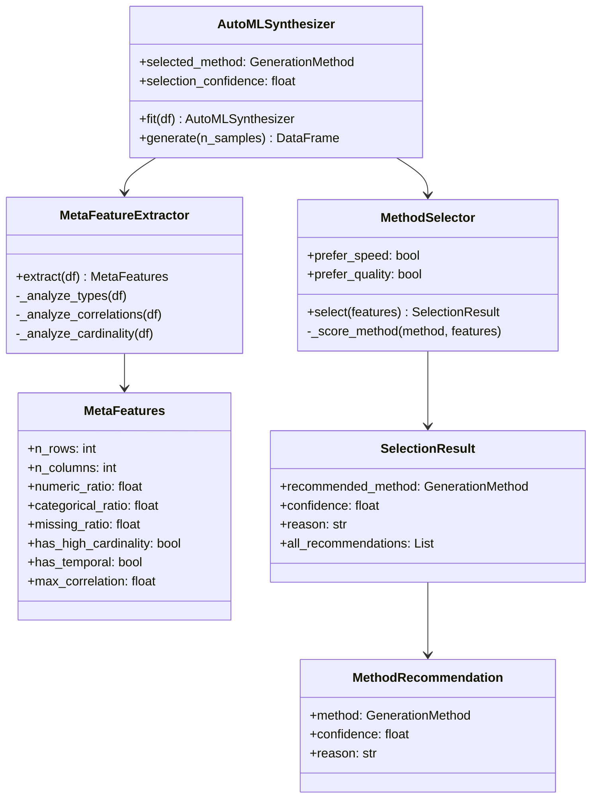

## Data Augmentation Architecture

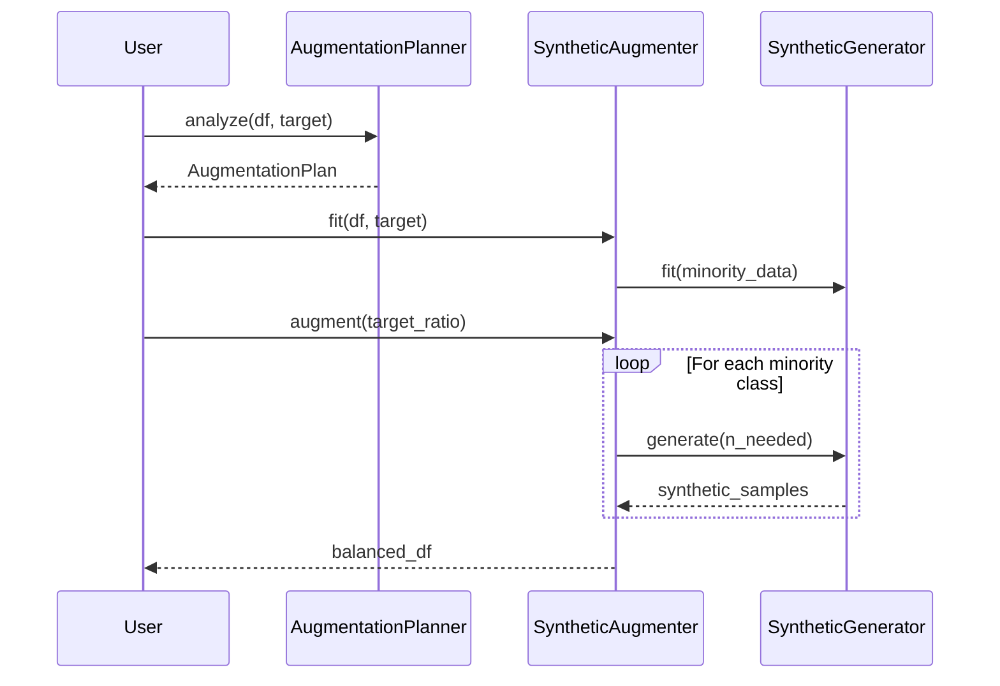

## Privacy Attack Testing Architecture

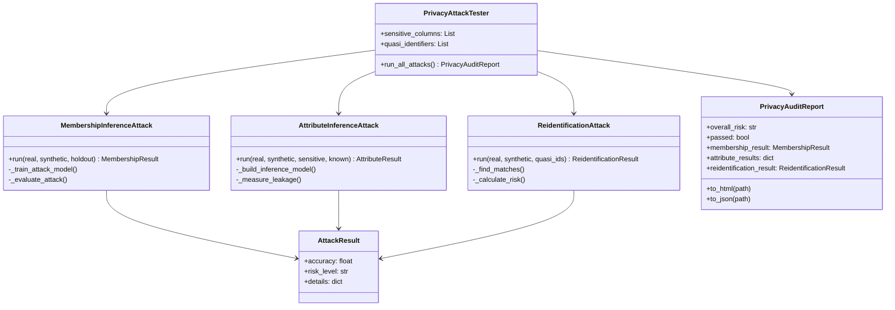

## Drift Detection Architecture

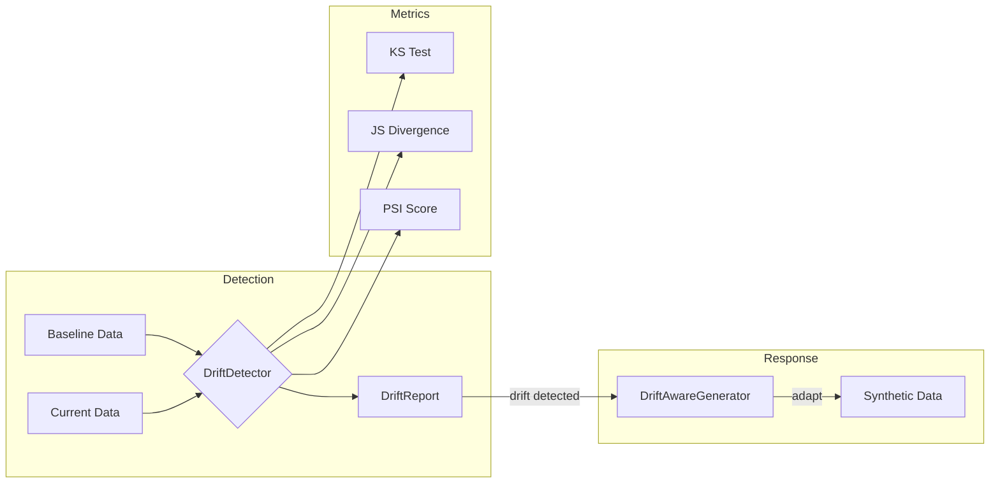

## Dataset Versioning Architecture

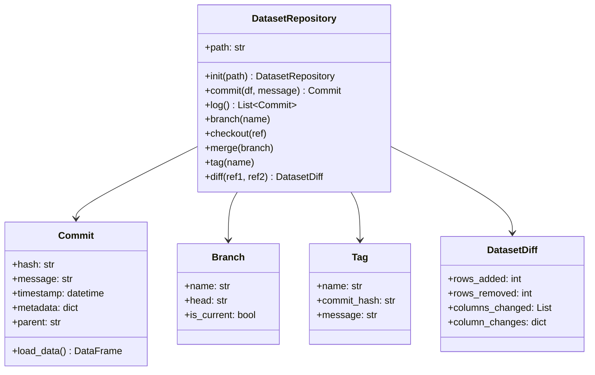

## Pipeline Builder Architecture

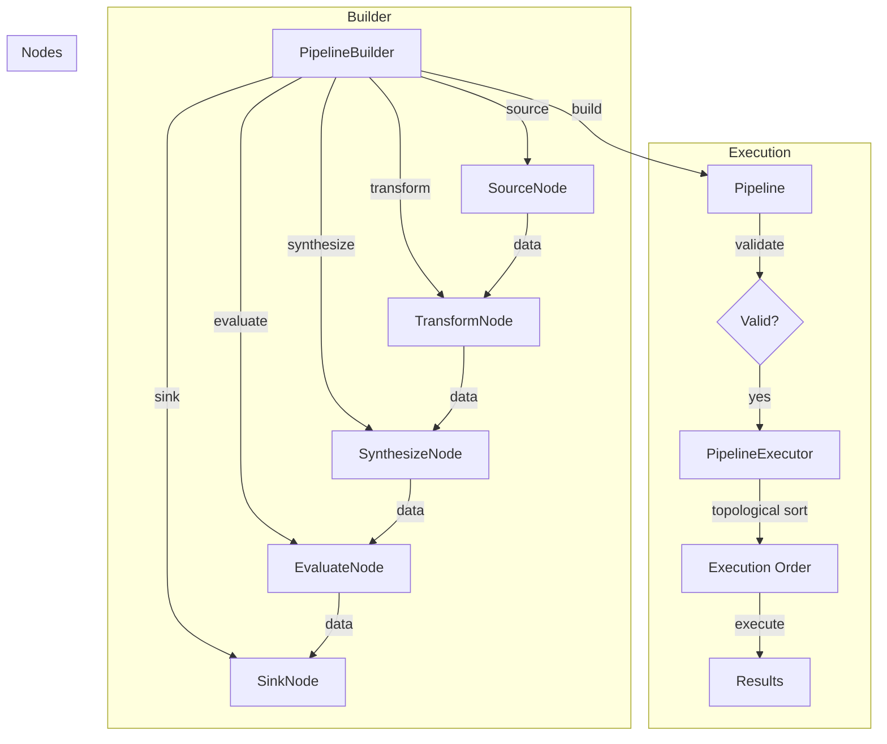

## Domain Generators Architecture

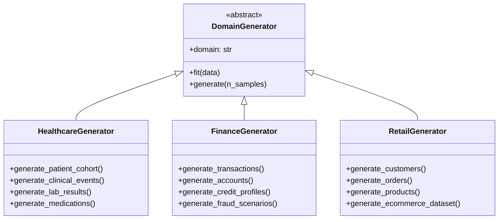

## GPU Acceleration Architecture

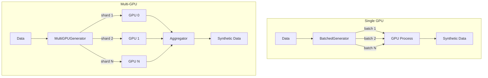

## LLM Schema Inference Architecture

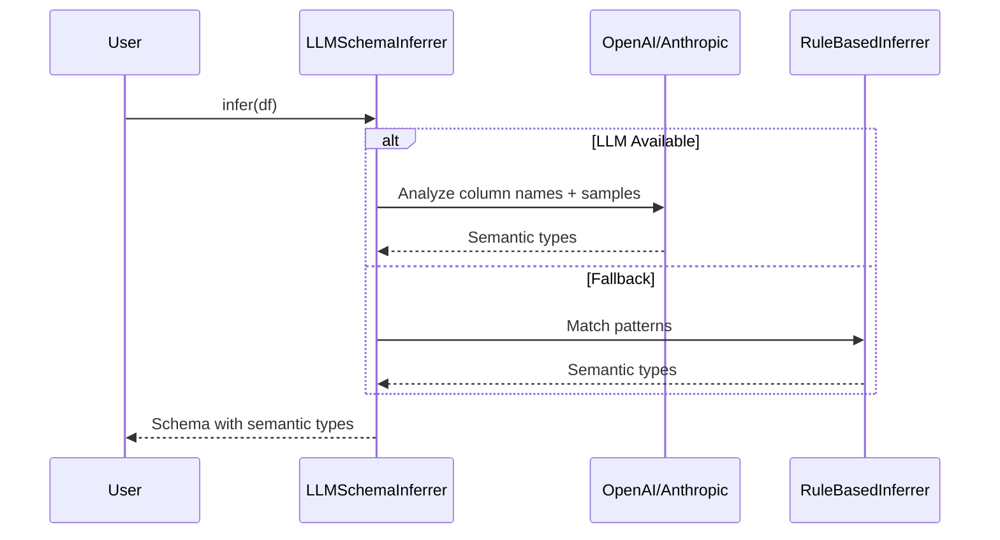

## Component Integration

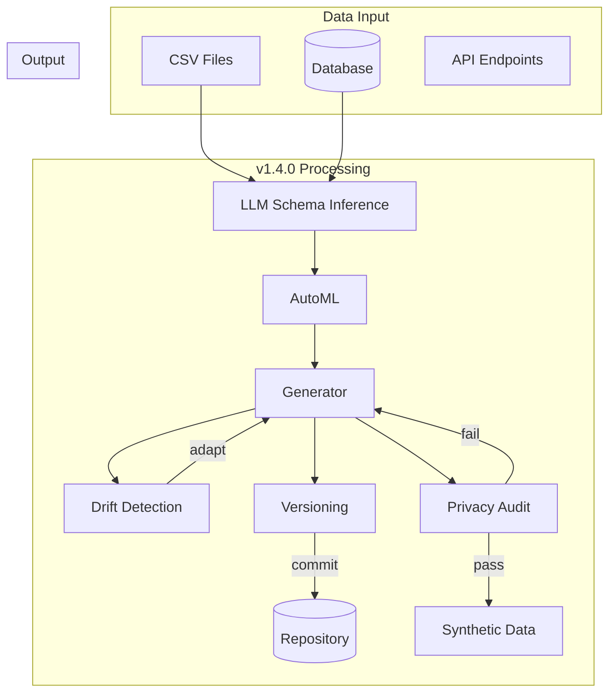

## Extension Points

### Custom Domain Generator

```python
from genesis.domains import DomainGenerator

class InsuranceGenerator(DomainGenerator):
    domain = "insurance"
    
    def generate_policies(self, n_policies: int) -> pd.DataFrame:
        # Custom implementation
        pass
    
    def generate_claims(self, n_claims: int) -> pd.DataFrame:
        # Custom implementation
        pass
```

### Custom Pipeline Node

```python
from genesis.pipeline import PipelineNode

class CustomNode(PipelineNode):
    node_type = "custom"
    
    def execute(self, inputs: dict) -> dict:
        # Custom processing
        return {"output": processed_data}
```

### Custom Privacy Attack

```python
from genesis.privacy_attacks import PrivacyAttack

class CustomAttack(PrivacyAttack):
    def run(self, real_data, synthetic_data) -> AttackResult:
        # Custom attack implementation
        return AttackResult(accuracy=0.5, risk_level="LOW")
```

## Performance Considerations

| Feature | Typical Performance | Optimization Strategy |
|---------|--------------------|-----------------------|
| AutoML | O(methods × fit_time) | Parallel method evaluation |
| Augmentation | O(n_minority × gen_time) | Batch generation |
| Privacy Attacks | O(n × m) for n records, m attacks | Sampling for large datasets |
| Drift Detection | O(n × cols) | Column-parallel computation |
| Versioning | O(1) commit, O(n) diff | Content-addressable storage |
| GPU Generation | 10-50x speedup | Batch size tuning |
| Pipeline | O(nodes) | Topological parallel execution |

## Security Considerations

1. **LLM Inference**: Never send sensitive data samples to external LLMs
2. **Privacy Attacks**: Results should be kept confidential
3. **Versioning**: Repository access should be controlled
4. **Domain Generators**: Healthcare data requires HIPAA compliance
5. **Pipeline**: Validate all inputs before execution
