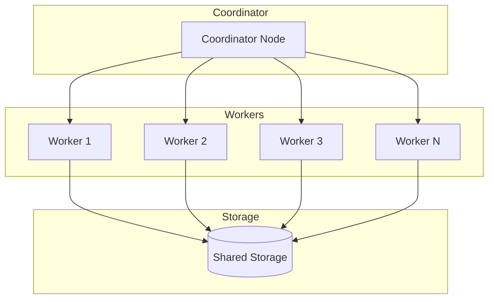

# Distributed Generation

Scale synthetic data generation across multiple machines.

## Overview

Genesis supports distributed generation for:
- Large-scale data generation (millions+ rows)
- Parallel training across datasets
- High-throughput streaming

## Architecture



## Quick Start

### Coordinator

```python
from genesis.distributed import Coordinator

coordinator = Coordinator(
    host='0.0.0.0',
    port=5000,
    n_workers=4
)

# Start coordinator
coordinator.start()

# Submit job
job_id = coordinator.submit(
    data='s3://bucket/data.parquet',
    method='ctgan',
    n_samples=10_000_000,
    output='s3://bucket/synthetic/'
)

# Monitor progress
status = coordinator.status(job_id)
print(f"Progress: {status.progress:.1%}")

# Wait for completion
result = coordinator.wait(job_id)
```

### Worker

```python
from genesis.distributed import Worker

worker = Worker(
    coordinator_url='http://coordinator:5000',
    device='cuda:0'
)

# Start worker (blocks until shutdown)
worker.run()
```

## Deployment Options

### Docker Compose

```yaml
# docker-compose.yml
version: '3.8'

services:
  coordinator:
    image: genesis:latest
    command: genesis-coordinator --port 5000
    ports:
      - "5000:5000"
    environment:
      - GENESIS_STORAGE=s3://bucket/genesis
      - AWS_ACCESS_KEY_ID=${AWS_ACCESS_KEY_ID}
      - AWS_SECRET_ACCESS_KEY=${AWS_SECRET_ACCESS_KEY}
  
  worker:
    image: genesis:latest
    command: genesis-worker --coordinator http://coordinator:5000
    deploy:
      replicas: 4
    environment:
      - GENESIS_DEVICE=cuda
```

### Kubernetes

```yaml
# coordinator.yaml
apiVersion: apps/v1
kind: Deployment
metadata:
  name: genesis-coordinator
spec:
  replicas: 1
  selector:
    matchLabels:
      app: genesis-coordinator
  template:
    metadata:
      labels:
        app: genesis-coordinator
    spec:
      containers:
      - name: coordinator
        image: genesis:latest
        command: ["genesis-coordinator", "--port", "5000"]
        ports:
        - containerPort: 5000
---
# worker.yaml
apiVersion: apps/v1
kind: Deployment
metadata:
  name: genesis-worker
spec:
  replicas: 8
  selector:
    matchLabels:
      app: genesis-worker
  template:
    metadata:
      labels:
        app: genesis-worker
    spec:
      containers:
      - name: worker
        image: genesis:latest
        command: ["genesis-worker", "--coordinator", "http://genesis-coordinator:5000"]
        resources:
          limits:
            nvidia.com/gpu: 1
```

## Distributed Training

Train a single model across multiple workers:

```python
from genesis.distributed import DistributedTrainer

trainer = DistributedTrainer(
    coordinator_url='http://coordinator:5000',
    method='ctgan',
    config={
        'epochs': 300,
        'batch_size': 500
    }
)

# Data is sharded automatically
trainer.fit(
    data='s3://bucket/large_dataset/',
    discrete_columns=['category', 'status']
)

# Save distributed model
trainer.save('s3://bucket/models/ctgan_distributed/')
```

### Aggregation Strategies

```python
trainer = DistributedTrainer(
    coordinator_url='http://coordinator:5000',
    aggregation='fedavg',     # 'fedavg', 'weighted', 'median'
    sync_frequency=10         # Sync every 10 batches
)
```

## Distributed Generation

Generate data in parallel:

```python
from genesis.distributed import DistributedGenerator

generator = DistributedGenerator(
    coordinator_url='http://coordinator:5000',
    model_path='s3://bucket/models/ctgan/'
)

# Generate 10M samples across workers
synthetic = generator.generate(
    n_samples=10_000_000,
    output='s3://bucket/synthetic/',
    chunk_size=100_000        # Each worker generates 100K at a time
)

print(f"Generated {synthetic.total_rows} rows")
print(f"Files: {synthetic.files}")
```

## Streaming Distribution

Distribute streaming generation:

```python
from genesis.distributed import StreamingCluster

cluster = StreamingCluster(
    coordinator_url='http://coordinator:5000',
    n_streams=10
)

# Each worker handles a stream
cluster.start_streaming(
    model_path='s3://bucket/models/ctgan/',
    kafka_brokers='kafka:9092',
    topic='synthetic-data',
    rate_per_second=10000     # Total across all workers
)
```

## Storage Backends

### S3

```python
from genesis.distributed import Coordinator

coordinator = Coordinator(
    storage={
        'type': 's3',
        'bucket': 'my-bucket',
        'prefix': 'genesis/',
        'aws_access_key_id': '...',
        'aws_secret_access_key': '...'
    }
)
```

### GCS

```python
coordinator = Coordinator(
    storage={
        'type': 'gcs',
        'bucket': 'my-bucket',
        'credentials': '/path/to/credentials.json'
    }
)
```

### Azure Blob

```python
coordinator = Coordinator(
    storage={
        'type': 'azure',
        'account_name': 'myaccount',
        'container': 'genesis',
        'account_key': '...'
    }
)
```

### HDFS

```python
coordinator = Coordinator(
    storage={
        'type': 'hdfs',
        'host': 'namenode',
        'port': 8020,
        'user': 'hadoop'
    }
)
```

## Monitoring

### Built-in Dashboard

```python
coordinator = Coordinator(
    host='0.0.0.0',
    port=5000,
    dashboard_port=8080       # Web UI at http://coordinator:8080
)
```

### Prometheus Metrics

```python
coordinator = Coordinator(
    metrics={
        'type': 'prometheus',
        'port': 9090
    }
)
```

Available metrics:
- `genesis_jobs_total` - Total jobs submitted
- `genesis_jobs_active` - Currently running jobs
- `genesis_samples_generated` - Samples generated
- `genesis_worker_count` - Active workers
- `genesis_generation_rate` - Samples per second

### Logging

```python
coordinator = Coordinator(
    logging={
        'level': 'INFO',
        'format': 'json',
        'output': 's3://bucket/logs/'
    }
)
```

## Fault Tolerance

### Automatic Retries

```python
coordinator = Coordinator(
    fault_tolerance={
        'max_retries': 3,
        'retry_delay': 60,      # seconds
        'checkpoint_interval': 1000  # samples
    }
)
```

### Checkpointing

```python
# Jobs automatically checkpoint progress
job_id = coordinator.submit(
    data='s3://bucket/data.parquet',
    n_samples=10_000_000,
    checkpoint_path='s3://bucket/checkpoints/'
)

# If worker fails, another picks up from checkpoint
```

## CLI

```bash
# Start coordinator
genesis-distributed coordinator \
  --port 5000 \
  --storage s3://bucket/genesis \
  --dashboard-port 8080

# Start worker
genesis-distributed worker \
  --coordinator http://coordinator:5000 \
  --device cuda:0

# Submit job
genesis-distributed submit \
  --coordinator http://coordinator:5000 \
  --data s3://bucket/data.parquet \
  --method ctgan \
  --samples 10000000 \
  --output s3://bucket/synthetic/

# Check status
genesis-distributed status \
  --coordinator http://coordinator:5000 \
  --job-id abc123
```

## Best Practices

1. **Right-size workers** - Match worker count to data size
2. **Use shared storage** - S3/GCS for data exchange
3. **Monitor progress** - Use dashboard or metrics
4. **Enable checkpointing** - For long-running jobs
5. **Test locally first** - Use single-machine mode

## Troubleshooting

### Workers not connecting
- Check firewall rules
- Verify coordinator URL is accessible
- Check worker logs

### Slow generation
- Increase worker count
- Use GPU-enabled workers
- Check network bandwidth

### Memory issues
- Reduce chunk_size
- Use streaming generation
- Add more workers (distribute load)

## Next Steps

- **[GPU Acceleration](/docs/advanced/gpu)** - GPU workers
- **[Federated Learning](/docs/advanced/federated)** - Privacy-preserving distributed
- **[Streaming](/docs/guides/streaming)** - Real-time generation
