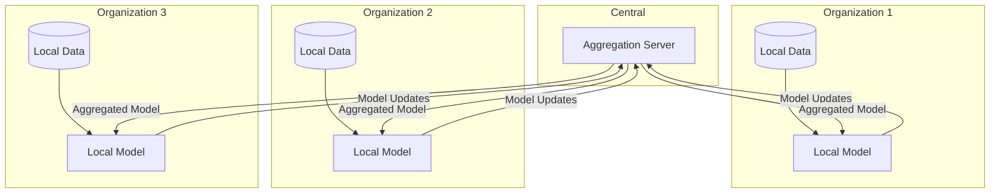

# Federated Learning

Train synthetic data generators across distributed data without centralization.

## Overview

Federated learning enables:
- Training on data that can't leave its location
- Privacy-preserving collaboration across organizations
- Compliance with data residency requirements



## Quick Start

### Central Server

```python
from genesis.federated import FederatedServer

server = FederatedServer(
    host='0.0.0.0',
    port=8000,
    method='ctgan',
    n_rounds=10,
    min_clients=3
)

# Start server (blocks until training complete)
server.start()

# After training, generate from aggregated model
synthetic = server.generate(1000)
```

### Client

```python
from genesis.federated import FederatedClient
import pandas as pd

# Load local data (never leaves this machine)
local_data = pd.read_csv('local_customers.csv')

client = FederatedClient(
    server_url='http://server:8000',
    client_id='org_1'
)

# Participate in federated training
client.train(
    local_data,
    discrete_columns=['status', 'region']
)
```

## FederatedSynthesizer

High-level API for simulated federated learning:

```python
from genesis.federated import FederatedSynthesizer

# Simulate federated learning with multiple datasets
synthesizer = FederatedSynthesizer(
    method='ctgan',
    n_rounds=10,
    aggregation='fedavg'
)

# Each dataset represents a different client's data
client_datasets = [
    pd.read_csv('hospital_1.csv'),
    pd.read_csv('hospital_2.csv'),
    pd.read_csv('hospital_3.csv'),
    pd.read_csv('hospital_4.csv')
]

# Train federated model
synthesizer.fit(client_datasets, discrete_columns=['diagnosis'])

# Generate from aggregated model
synthetic = synthesizer.generate(10000)
```

## Aggregation Strategies

### FedAvg (Default)

Simple averaging of model weights:

```python
synthesizer = FederatedSynthesizer(
    method='ctgan',
    aggregation='fedavg'
)
```

### Weighted FedAvg

Weight by dataset size:

```python
synthesizer = FederatedSynthesizer(
    method='ctgan',
    aggregation='weighted',  # Weights by client data size
)
```

### FedProx

Handles heterogeneous data:

```python
synthesizer = FederatedSynthesizer(
    method='ctgan',
    aggregation='fedprox',
    proximal_mu=0.01  # Regularization strength
)
```

### Median Aggregation

Robust to outliers:

```python
synthesizer = FederatedSynthesizer(
    method='ctgan',
    aggregation='median'
)
```

## Privacy Enhancements

### Differential Privacy

Add noise to updates:

```python
client = FederatedClient(
    server_url='http://server:8000',
    privacy={
        'differential_privacy': {
            'epsilon': 1.0,
            'delta': 1e-5,
            'max_grad_norm': 1.0
        }
    }
)
```

### Secure Aggregation

Encrypt model updates:

```python
server = FederatedServer(
    host='0.0.0.0',
    port=8000,
    secure_aggregation=True,
    encryption='paillier'  # Homomorphic encryption
)
```

### Gradient Clipping

Limit information leakage:

```python
client = FederatedClient(
    server_url='http://server:8000',
    max_grad_norm=1.0,
    clip_per_layer=True
)
```

## Client Configuration

```python
client = FederatedClient(
    server_url='http://server:8000',
    client_id='hospital_1',
    
    # Training config
    local_epochs=5,           # Epochs per round
    batch_size=64,
    learning_rate=0.001,
    
    # Privacy
    privacy={
        'differential_privacy': {'epsilon': 1.0}
    },
    
    # Communication
    compression='gzip',       # Compress updates
    retry_attempts=3,
    timeout_seconds=300
)
```

## Server Configuration

```python
server = FederatedServer(
    host='0.0.0.0',
    port=8000,
    
    # Model config
    method='ctgan',
    config={'epochs': 300},
    
    # Federated config
    n_rounds=10,              # Total communication rounds
    min_clients=3,            # Minimum clients to start
    max_clients=100,
    client_fraction=0.5,      # Fraction of clients per round
    
    # Aggregation
    aggregation='fedavg',
    
    # Security
    auth_token=os.environ.get('FEDERATED_AUTH_TOKEN'),
    ssl_cert='server.crt',
    ssl_key='server.key'
)
```

## Handling Non-IID Data

Real-world federated data is often non-IID (not identically distributed):

```python
synthesizer = FederatedSynthesizer(
    method='ctgan',
    
    # Handle data heterogeneity
    aggregation='fedprox',
    proximal_mu=0.1,
    
    # More local training per round
    local_epochs=10,
    
    # Adaptive learning rate
    lr_schedule='cosine'
)

# FedProx helps when clients have different distributions
synthesizer.fit(heterogeneous_datasets)
```

## Monitoring Training

### Server-Side

```python
server = FederatedServer(
    callbacks=[
        RoundCallback(),      # Called each round
        MetricsCallback(),    # Track metrics
        CheckpointCallback()  # Save progress
    ]
)

@server.on_round_complete
def log_round(round_num, metrics):
    print(f"Round {round_num}: {metrics}")
```

### Client-Side

```python
client = FederatedClient(
    server_url='http://server:8000',
    verbose=True
)

@client.on_train_complete
def log_training(metrics):
    print(f"Local training: {metrics}")
```

## Deployment

### Docker

```yaml
# docker-compose.yml
version: '3.8'

services:
  server:
    image: genesis:latest
    command: genesis-federated server --port 8000
    ports:
      - "8000:8000"
    environment:
      - GENESIS_METHOD=ctgan
      - GENESIS_ROUNDS=10
      - GENESIS_MIN_CLIENTS=3

  client1:
    image: genesis:latest
    command: genesis-federated client --server http://server:8000 --data /data/client1.csv
    volumes:
      - ./data/client1:/data

  client2:
    image: genesis:latest
    command: genesis-federated client --server http://server:8000 --data /data/client2.csv
    volumes:
      - ./data/client2:/data
```

### Kubernetes

```yaml
# server.yaml
apiVersion: apps/v1
kind: Deployment
metadata:
  name: genesis-federated-server
spec:
  replicas: 1
  template:
    spec:
      containers:
      - name: server
        image: genesis:latest
        command: ["genesis-federated", "server"]
        ports:
        - containerPort: 8000
        env:
        - name: GENESIS_METHOD
          value: "ctgan"
        - name: GENESIS_ROUNDS
          value: "10"
```

## CLI

```bash
# Start server
genesis federated server \
  --port 8000 \
  --method ctgan \
  --rounds 10 \
  --min-clients 3

# Join as client
genesis federated client \
  --server http://server:8000 \
  --data local_data.csv \
  --discrete-columns status,region \
  --client-id org_1

# Check status
genesis federated status --server http://server:8000
```

## Complete Example

### Server (Central Coordinator)

```python
from genesis.federated import FederatedServer

server = FederatedServer(
    host='0.0.0.0',
    port=8000,
    method='ctgan',
    config={'epochs': 100},
    n_rounds=10,
    min_clients=3,
    aggregation='fedavg',
    ssl_cert='server.crt',
    ssl_key='server.key'
)

@server.on_round_complete
def log_progress(round_num, metrics, n_clients):
    print(f"Round {round_num}/{server.n_rounds}")
    print(f"  Clients: {n_clients}")
    print(f"  Metrics: {metrics}")

@server.on_training_complete
def save_model(model):
    model.save('federated_model.pkl')
    synthetic = model.generate(10000)
    synthetic.to_csv('federated_synthetic.csv')

server.start()
```

### Client (Hospital 1)

```python
import pandas as pd
from genesis.federated import FederatedClient

# Load local patient data
patients = pd.read_csv('hospital_1_patients.csv')

client = FederatedClient(
    server_url='https://coordinator.example.com:8000',
    client_id='hospital_1',
    local_epochs=5,
    privacy={
        'differential_privacy': {
            'epsilon': 1.0,
            'delta': 1e-5
        }
    },
    ssl_verify='ca.crt'
)

# Join federated training
client.train(
    patients,
    discrete_columns=['diagnosis', 'treatment', 'outcome']
)

print("Training complete!")
```

## Best Practices

1. **Use secure connections** - Always enable SSL/TLS
2. **Add differential privacy** - Especially for sensitive data
3. **Handle stragglers** - Set reasonable timeouts
4. **Monitor convergence** - Track metrics across rounds
5. **Test locally first** - Use FederatedSynthesizer for simulation

## Troubleshooting

### Clients not connecting
- Check firewall rules
- Verify SSL certificates
- Check server logs

### Slow convergence
- Increase local epochs
- Try FedProx for non-IID data
- Adjust learning rate

### Model divergence
- Reduce learning rate
- Add gradient clipping
- Use more rounds with fewer local epochs

## Next Steps

- **[Privacy Configuration](/docs/concepts/privacy)** - Differential privacy settings
- **[Distributed Generation](/docs/advanced/distributed)** - Scale generation
- **[Privacy Attacks](/docs/guides/privacy-attacks)** - Verify privacy guarantees
