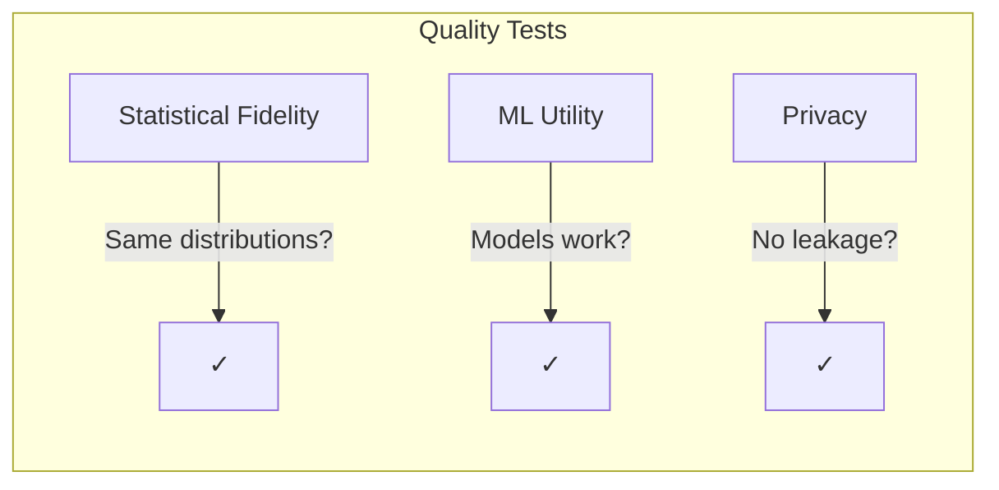

# Quality Evaluation

Validating synthetic data quality is crucial. Genesis provides comprehensive evaluation tools to ensure your data is realistic and useful.

## Why Evaluate?

Synthetic data must pass three tests:



## Quick Evaluation

```python
from genesis import QualityEvaluator

evaluator = QualityEvaluator(real_data, synthetic_data)
report = evaluator.evaluate()

print(f"Overall Score: {report.overall_score:.1%}")
print(f"Fidelity: {report.fidelity_score:.1%}")
print(f"Utility: {report.utility_score:.1%}")
print(f"Privacy: {report.privacy_score:.1%}")
```

## Statistical Fidelity

Measures how well synthetic data matches real data distributions.

### Column-Level Metrics

```python
# Per-column analysis
for col, metrics in report.column_metrics.items():
    print(f"{col}:")
    print(f"  Type: {metrics['dtype']}")
    print(f"  Similarity: {metrics['similarity']:.2f}")
    print(f"  KS Statistic: {metrics.get('ks_stat', 'N/A')}")
```

### Numeric Columns

| Metric | What It Measures | Good Score |
|--------|-----------------|------------|
| KS Statistic | Distribution shape difference | < 0.1 |
| Mean Difference | Average value similarity | < 5% |
| Std Difference | Spread similarity | < 10% |
| Correlation | Linear relationship preservation | > 0.9 |

```python
from genesis.evaluation import compute_statistical_fidelity

fidelity = compute_statistical_fidelity(real_df, synthetic_df)
print(f"Numeric fidelity: {fidelity['numeric_score']:.2f}")
print(f"Categorical fidelity: {fidelity['categorical_score']:.2f}")
```

### Categorical Columns

| Metric | What It Measures | Good Score |
|--------|-----------------|------------|
| Chi-squared | Category frequency match | p > 0.05 |
| JS Divergence | Distribution similarity | < 0.1 |
| Coverage | All categories represented | 100% |

### Correlation Preservation

```python
# Check if correlations are preserved
real_corr = real_df.corr()
syn_corr = synthetic_df.corr()
corr_diff = (real_corr - syn_corr).abs().mean().mean()

print(f"Average correlation difference: {corr_diff:.3f}")
```

## ML Utility

Can models trained on synthetic data perform as well as models trained on real data?

### Train on Synthetic, Test on Real (TSTR)

```python
from genesis.evaluation import compute_ml_utility

utility = compute_ml_utility(
    real_train=real_train,
    real_test=real_test,
    synthetic=synthetic_data,
    target_column='churn'
)

print(f"Real model accuracy: {utility['real_accuracy']:.1%}")
print(f"Synthetic model accuracy: {utility['synthetic_accuracy']:.1%}")
print(f"Utility score: {utility['utility_score']:.1%}")
```

### Feature Importance

```python
# Compare feature importance
print("Feature importance comparison:")
for feature, (real_imp, syn_imp) in utility['feature_importance'].items():
    diff = abs(real_imp - syn_imp)
    print(f"  {feature}: real={real_imp:.3f}, syn={syn_imp:.3f}, diff={diff:.3f}")
```

### Supported Tasks

| Task | Metric | Model |
|------|--------|-------|
| Classification | Accuracy, F1 | RandomForest |
| Regression | R², MSE | RandomForest |
| Clustering | Silhouette | KMeans |

## Privacy Metrics

Ensure synthetic data doesn't leak information.

### Distance to Closest Record (DCR)

```python
from genesis.evaluation import compute_dcr

dcr = compute_dcr(real_df, synthetic_df)
print(f"Median DCR: {dcr['median']:.4f}")
print(f"Min DCR: {dcr['min']:.4f}")  # Should be > 0
print(f"Records at risk: {dcr['at_risk_count']}")
```

A DCR of 0 means a synthetic record is identical to a real record (bad).

### Membership Inference Risk

```python
from genesis.privacy_attacks import MembershipInferenceAttack

attack = MembershipInferenceAttack()
result = attack.run(real_df, synthetic_df, holdout_df)

print(f"Attack accuracy: {result.accuracy:.1%}")
print(f"Risk level: {result.risk_level}")

# Good: ~50% (random guessing)
# Bad: >60% (can distinguish members)
```

### Attribute Disclosure Risk

```python
from genesis.privacy_attacks import AttributeInferenceAttack

attack = AttributeInferenceAttack()
result = attack.run(
    real_df, synthetic_df,
    sensitive_column='income',
    known_columns=['age', 'education']
)

print(f"Inference accuracy: {result.accuracy:.1%}")
print(f"Baseline: {result.baseline:.1%}")
print(f"Risk: {result.risk_level}")
```

## Quality Report

Generate a comprehensive HTML report:

```python
evaluator = QualityEvaluator(real_df, synthetic_df)
report = evaluator.evaluate(target_column='churn')

# Console summary
print(report.summary())

# Export reports
report.to_html('quality_report.html')
report.to_json('quality_report.json')
report.to_pdf('quality_report.pdf')  # Requires weasyprint
```

### Report Contents

1. **Executive Summary**
   - Overall quality score
   - Pass/fail status
   - Key findings

2. **Statistical Analysis**
   - Per-column metrics
   - Distribution comparisons
   - Correlation matrices

3. **ML Utility**
   - Model performance comparison
   - Feature importance analysis
   - Prediction correlation

4. **Privacy Analysis**
   - DCR distribution
   - Attack simulation results
   - Compliance status

## Interactive Dashboard

Visualize quality with an interactive dashboard:

```python
from genesis.dashboard import QualityDashboard

dashboard = QualityDashboard(real_df, synthetic_df)
dashboard.run(port=8050)  # Opens at http://localhost:8050
```

### Dashboard Features

- Distribution comparisons
- Correlation heatmaps
- Column-by-column analysis
- Privacy risk visualization
- Export to PDF

## Evaluation Best Practices

### 1. Always Evaluate Before Using

```python
report = QualityEvaluator(real_df, synthetic_df).evaluate()
assert report.overall_score > 0.85, f"Quality too low: {report.overall_score}"
```

### 2. Check Column-Level Quality

```python
for col, metrics in report.column_metrics.items():
    if metrics['similarity'] < 0.8:
        print(f"Warning: {col} has low similarity ({metrics['similarity']:.2f})")
```

### 3. Validate ML Utility for Your Task

```python
if report.utility_score < 0.9:
    print("Warning: Synthetic data may not work well for ML training")
```

### 4. Run Privacy Checks for Sensitive Data

```python
from genesis import run_privacy_audit

privacy_report = run_privacy_audit(real_df, synthetic_df)
assert privacy_report.passed, "Privacy audit failed"
```

### 5. Compare Multiple Generators

```python
results = {}
for method in ['gaussian_copula', 'ctgan', 'tvae']:
    generator = SyntheticGenerator(method=method)
    generator.fit(real_df)
    synthetic = generator.generate(len(real_df))
    
    report = QualityEvaluator(real_df, synthetic).evaluate()
    results[method] = report.overall_score

best = max(results, key=results.get)
print(f"Best method: {best} ({results[best]:.1%})")
```

## Evaluation Thresholds

Recommended minimum scores:

| Metric | Minimum | Target | Excellent |
|--------|---------|--------|-----------|
| Overall Score | 80% | 90% | 95%+ |
| Statistical Fidelity | 85% | 92% | 97%+ |
| ML Utility | 80% | 90% | 95%+ |
| Privacy Score | 95% | 98% | 99%+ |

## Troubleshooting Low Scores

### Low Statistical Fidelity

- Try a more powerful generator (CTGAN over GaussianCopula)
- Increase training epochs
- Check for data preprocessing issues

### Low ML Utility

- Ensure target column is learned properly
- Try conditional generation
- Check for class imbalance

### Low Privacy Score

- Enable differential privacy
- Increase epsilon
- Check for rare categories

## Next Steps

- **[Constraints](/docs/concepts/constraints)** - Control output quality
- **[Privacy Attack Testing](/docs/guides/privacy-attacks)** - Deep dive into privacy validation
- **[Troubleshooting](/docs/troubleshooting)** - Common issues and fixes
