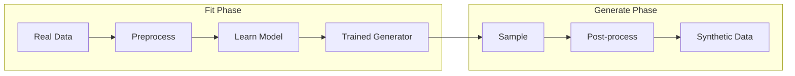
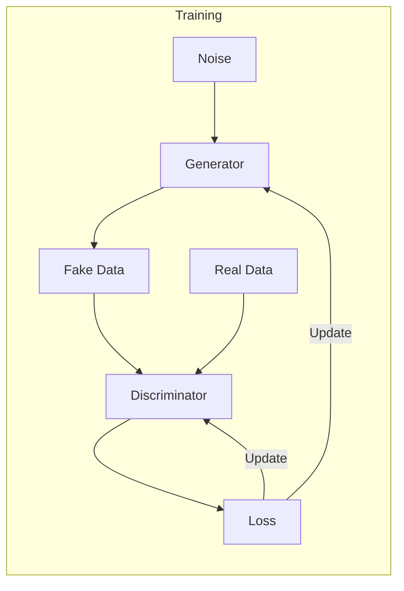
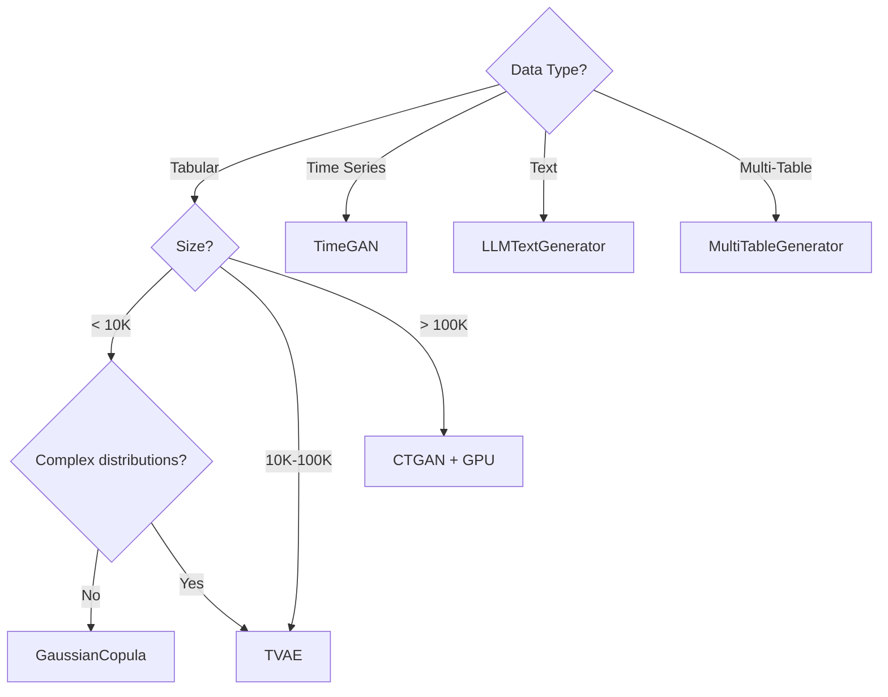

# Understanding Generators

Generators are the core of Genesis. Each generator uses a different algorithm to learn and reproduce data patterns.

## How Generators Work

All generators follow the same interface but use different underlying methods:



## Gaussian Copula

**Algorithm:** Statistical copulas that model marginal distributions and dependencies separately.

```python
from genesis import SyntheticGenerator

generator = SyntheticGenerator(method='gaussian_copula')
generator.fit(df, discrete_columns=['category'])
synthetic = generator.generate(1000)
```

### How It Works

1. **Transform marginals**: Convert each column to uniform distribution
2. **Fit copula**: Learn the correlation structure
3. **Sample**: Generate correlated uniform samples
4. **Inverse transform**: Convert back to original distributions

### Configuration

```python
generator = SyntheticGenerator(
    method='gaussian_copula',
    config={
        'default_distribution': 'parametric',  # or 'gaussian_kde'
        'categorical_transformer': 'label_encoding',
    }
)
```

### When to Use

✅ Small datasets (< 10K rows)
✅ Fast iteration during development
✅ Strong linear correlations
✅ Simple distributions

❌ Complex, multimodal distributions
❌ High-cardinality categories (> 100 unique values)
❌ Non-linear relationships

## CTGAN (Conditional Tabular GAN)

**Algorithm:** Generative Adversarial Network with mode-specific normalization for mixed-type data.

```python
from genesis import SyntheticGenerator

generator = SyntheticGenerator(
    method='ctgan',
    config={
        'epochs': 300,
        'batch_size': 500,
        'generator_dim': (256, 256),
        'discriminator_dim': (256, 256),
        'pac': 10
    }
)
generator.fit(df, discrete_columns=['category'])
synthetic = generator.generate(1000)
```

### How It Works



1. **Mode-specific normalization**: Handle multimodal numeric distributions
2. **Conditional generator**: Sample from specific categories
3. **Training-by-sampling**: Balance category representation
4. **PacGAN**: Stabilize training with packed samples

### Configuration Options

| Parameter | Default | Description |
|-----------|---------|-------------|
| `epochs` | 300 | Training iterations |
| `batch_size` | 500 | Samples per batch |
| `generator_dim` | (256, 256) | Generator network layers |
| `discriminator_dim` | (256, 256) | Discriminator network layers |
| `generator_lr` | 2e-4 | Generator learning rate |
| `discriminator_lr` | 2e-4 | Discriminator learning rate |
| `discriminator_steps` | 1 | Discriminator updates per generator update |
| `pac` | 10 | PacGAN packing size |

### When to Use

✅ Complex, multimodal distributions
✅ High-cardinality categories
✅ Large datasets (10K+ rows)
✅ Production quality requirements

❌ Very small datasets (< 1K rows)
❌ Need fast training
❌ Limited compute resources (use GPU)

## TVAE (Tabular Variational Autoencoder)

**Algorithm:** Variational Autoencoder with reversible data transformations.

```python
from genesis import SyntheticGenerator

generator = SyntheticGenerator(
    method='tvae',
    config={
        'epochs': 300,
        'batch_size': 500,
        'compress_dims': (128, 128),
        'decompress_dims': (128, 128),
        'l2scale': 1e-5,
        'loss_factor': 2
    }
)
generator.fit(df, discrete_columns=['category'])
synthetic = generator.generate(1000)
```

### How It Works

```mermaid
flowchart LR
    subgraph Encoder
        X[Input] --> E1[Compress]
        E1 --> MU[μ]
        E1 --> SIGMA[σ]
    end
    
    subgraph Latent
        MU --> Z[z ~ N(μ,σ)]
        SIGMA --> Z
    end
    
    subgraph Decoder
        Z --> D1[Decompress]
        D1 --> X2[Reconstruction]
    end
```

1. **Encode**: Compress data to latent representation
2. **Reparameterization**: Sample from learned distribution
3. **Decode**: Reconstruct data from latent samples
4. **Loss**: Minimize reconstruction + KL divergence

### When to Use

✅ More stable training than GAN
✅ Medium-sized datasets
✅ Good balance of speed and quality
✅ Smooth latent interpolation

❌ May produce less diverse outputs
❌ Complex multimodal distributions

## TimeGAN

**Algorithm:** GAN-based temporal data generator that preserves temporal dynamics.

```python
from genesis.generators.timeseries import TimeGANGenerator

generator = TimeGANGenerator(
    seq_len=24,           # Length of sequences
    n_features=5,         # Number of features
    hidden_dim=24,        # Hidden layer size
    num_layers=3,         # RNN layers
    epochs=100
)

# Expects 3D data: (samples, time_steps, features)
generator.fit(time_series_data)
synthetic_sequences = generator.generate(100)
```

### How It Works

1. **Embedding network**: Learn feature representations
2. **Recovery network**: Reconstruct from embeddings
3. **Sequence generator**: Generate in embedding space
4. **Sequence discriminator**: Distinguish real/fake sequences
5. **Supervisor**: Enforce temporal consistency

### When to Use

✅ Time series data
✅ Sequential patterns matter
✅ Temporal correlations
✅ Fixed-length sequences

## LLM Text Generator

**Algorithm:** Large Language Model-based text generation with constraints.

```python
from genesis.generators.text import LLMTextGenerator

generator = LLMTextGenerator(
    provider='openai',
    model='gpt-4o-mini',
    api_key='your-api-key'
)

texts = generator.generate(
    n_samples=100,
    prompt="Generate a realistic customer review",
    constraints={
        'sentiment': 'mixed',
        'length': 'medium',
        'style': 'casual'
    }
)
```

### Supported Providers

| Provider | Models | Best For |
|----------|--------|----------|
| OpenAI | gpt-4o, gpt-4o-mini | High quality, diverse |
| Anthropic | claude-3-sonnet | Nuanced, factual |
| HuggingFace | Llama, Mistral | Self-hosted, cost-effective |

## Multi-Table Generator

**Algorithm:** Hierarchical generation preserving referential integrity.

```python
from genesis.multitable import MultiTableGenerator, RelationalSchema

schema = RelationalSchema()
schema.add_table('customers', primary_key='customer_id')
schema.add_table('orders', primary_key='order_id')
schema.add_relationship('orders', 'customer_id', 'customers', 'customer_id')

generator = MultiTableGenerator(schema=schema, method='ctgan')
generator.fit({
    'customers': customers_df,
    'orders': orders_df
})

synthetic_db = generator.generate({
    'customers': 1000,
    'orders': 5000
})
```

### How It Works

1. **Analyze schema**: Detect tables and relationships
2. **Order by dependency**: Parent tables first
3. **Generate parents**: Create primary key values
4. **Generate children**: Sample valid foreign keys
5. **Preserve ratios**: Maintain relationship cardinality

## Generator Selection Summary



## Performance Tuning

### For Speed

```python
# Use simpler architecture
generator = SyntheticGenerator(
    method='ctgan',
    config={
        'epochs': 100,  # Fewer epochs
        'generator_dim': (128,),  # Smaller network
        'discriminator_dim': (128,),
        'batch_size': 1000  # Larger batches
    }
)
```

### For Quality

```python
# Use more capacity
generator = SyntheticGenerator(
    method='ctgan',
    config={
        'epochs': 500,  # More training
        'generator_dim': (256, 256, 256),  # Deeper network
        'discriminator_dim': (256, 256, 256),
        'batch_size': 200,  # Smaller batches
        'discriminator_steps': 5  # More discriminator training
    }
)
```

### For Large Datasets

```python
from genesis.gpu import BatchedGenerator

generator = BatchedGenerator(
    method='ctgan',
    device='cuda',
    batch_size=10000
)
generator.fit(large_df)
synthetic = generator.generate(1_000_000)
```

## Next Steps

- **[Privacy Configuration](/docs/concepts/privacy)** - Add privacy guarantees
- **[Quality Evaluation](/docs/concepts/evaluation)** - Validate synthetic data
- **[AutoML Guide](/docs/guides/automl)** - Automatic method selection
