# Core Concepts

Understanding how synthetic data generation works will help you get the most out of Genesis.

## What is Synthetic Data?

Synthetic data is artificially generated data that mimics the statistical properties of real data without containing any actual records from the original dataset.

```mermaid
flowchart LR
    subgraph Real[Real Data]
        R1[John, 35, $75K]
        R2[Jane, 28, $62K]
        R3[Bob, 45, $95K]
    end
    
    subgraph Model[Statistical Model]
        M1[Age: Normal μ=36]
        M2[Income: LogNormal]
        M3[Correlations]
    end
    
    subgraph Synthetic[Synthetic Data]
        S1[Alex, 32, $68K]
        S2[Sam, 41, $88K]
        S3[Pat, 29, $71K]
    end
    
    Real --> |Learn| Model
    Model --> |Generate| Synthetic
    
    style Real fill:#ffcdd2
    style Synthetic fill:#c8e6c9
```



**Key insight:** Synthetic data contains no real individuals, but maintains the same patterns and relationships.

## The Fit-Generate Pattern

Genesis follows a simple two-step pattern similar to scikit-learn:

```python
from genesis import SyntheticGenerator

# Step 1: Fit - Learn from real data
generator = SyntheticGenerator(method='ctgan')
generator.fit(real_data)

# Step 2: Generate - Create new data
synthetic_data = generator.generate(n_samples=1000)
```

### What Happens During Fit?

1. **Schema Detection**: Identify column types (numeric, categorical, datetime)
2. **Distribution Learning**: Model the distribution of each column
3. **Correlation Capture**: Learn relationships between columns
4. **Constraint Detection**: Identify implicit constraints (ranges, uniqueness)

### What Happens During Generate?

1. **Sample Generation**: Draw new values from learned distributions
2. **Correlation Preservation**: Maintain learned relationships
3. **Constraint Enforcement**: Apply any explicit constraints
4. **Post-processing**: Convert to proper types

## Key Metrics

### Statistical Fidelity

How well does synthetic data match real data distributions?

```python
from genesis import QualityEvaluator

evaluator = QualityEvaluator(real_data, synthetic_data)
report = evaluator.evaluate()

print(f"Fidelity: {report.fidelity_score:.1%}")
```

**What's measured:**
- Distribution similarity (KS test, chi-squared)
- Correlation preservation
- Marginal and joint distributions

### ML Utility

Can models trained on synthetic data perform as well as models trained on real data?

```python
# Train on synthetic, test on real (TSTR)
print(f"ML Utility: {report.utility_score:.1%}")
```

**What's measured:**
- Model performance parity
- Feature importance similarity
- Prediction correlation

### Privacy Score

How well does synthetic data protect individual privacy?

```python
print(f"Privacy: {report.privacy_score:.1%}")
```

**What's measured:**
- Distance to closest record (DCR)
- Membership inference risk
- Attribute disclosure risk

## Data Flow Architecture


## Generator Types

Genesis provides different generators optimized for different data characteristics:

| Generator | Underlying Method | Best Use Case |
|-----------|------------------|---------------|
| `gaussian_copula` | Statistical copulas | Small data, fast iteration |
| `ctgan` | Conditional GAN | Complex, high-cardinality data |
| `tvae` | Variational Autoencoder | Balanced speed/quality |
| `auto` | AutoML selection | Let Genesis decide |

## Privacy Concepts

### Differential Privacy

Mathematical guarantee that individual records can't be identified:

```python
from genesis import PrivacyConfig

privacy = PrivacyConfig(
    enable_differential_privacy=True,
    epsilon=1.0  # Lower = more private, less accurate
)

generator = SyntheticGenerator(method='ctgan', privacy=privacy)
```

### K-Anonymity

Ensure each combination of quasi-identifiers appears at least K times:

```python
from genesis.privacy import check_k_anonymity

result = check_k_anonymity(
    synthetic_data,
    quasi_identifiers=['age', 'zipcode', 'gender'],
    k=5
)
print(f"Satisfies 5-anonymity: {result['satisfies_k']}")
```

## Constraints

Control the output with explicit constraints:

```python
from genesis import Constraint

generator.fit(
    data,
    discrete_columns=['category', 'status'],
    constraints=[
        Constraint.positive('age'),
        Constraint.range('age', 18, 120),
        Constraint.unique('customer_id')
    ]
)
```

## Quality Evaluation

Always validate your synthetic data:

```python
from genesis import QualityEvaluator

evaluator = QualityEvaluator(real_data, synthetic_data)
report = evaluator.evaluate(target_column='churn')

# Overall metrics
print(report.summary())

# Detailed per-column analysis
for col, metrics in report.column_metrics.items():
    print(f"{col}: similarity={metrics['similarity']:.2f}")

# Export report
report.to_html('quality_report.html')
```

## Best Practices

### 1. Start with AutoML

```python
from genesis import auto_synthesize

# Let Genesis analyze your data and pick the best method
synthetic = auto_synthesize(df, n_samples=1000)
```

### 2. Always Evaluate

```python
from genesis import QualityEvaluator

report = QualityEvaluator(real, synthetic).evaluate()
assert report.overall_score > 0.85, "Quality too low"
```

### 3. Add Privacy for Sensitive Data

```python
from genesis import PrivacyConfig

generator = SyntheticGenerator(
    privacy=PrivacyConfig(epsilon=1.0)
)
```

### 4. Use Constraints for Business Rules

```python
generator.fit(data, constraints=[
    Constraint.positive('amount'),
    Constraint.range('rating', 1, 5)
])
```

### 5. Version Your Datasets

```python
from genesis.versioning import DatasetRepository

repo = DatasetRepository.init('./data_versions')
repo.commit(synthetic, message="Initial generation")
```

## Next Steps

- **[Generators Deep Dive](/docs/concepts/generators)** - How each generator works
- **[Privacy Configuration](/docs/concepts/privacy)** - Protect sensitive data
- **[Quality Evaluation](/docs/concepts/evaluation)** - Validate your synthetic data
- **[Constraints](/docs/concepts/constraints)** - Control output with rules
