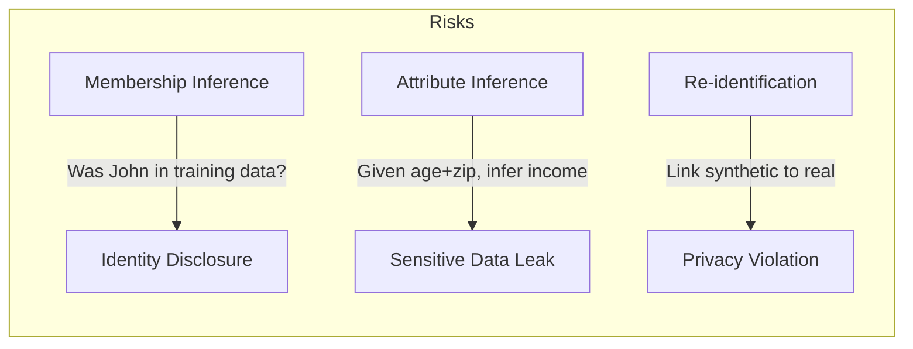
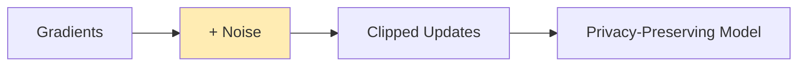

# Privacy Configuration

Genesis provides multiple privacy mechanisms to ensure synthetic data doesn't leak information about real individuals.

## Why Privacy Matters

Synthetic data can still pose privacy risks:



Genesis addresses these with multiple privacy layers.

## Quick Start: Enable Privacy

```python
from genesis import SyntheticGenerator, PrivacyConfig

privacy = PrivacyConfig(
    enable_differential_privacy=True,
    epsilon=1.0
)

generator = SyntheticGenerator(method='ctgan', privacy=privacy)
generator.fit(sensitive_data)
synthetic = generator.generate(1000)
```

## Differential Privacy

Mathematical guarantee that any individual's data doesn't significantly affect the output.

### How It Works



The key parameter is **epsilon (ε)**: lower = more private, less accurate.

| Epsilon | Privacy Level | Data Utility |
|---------|--------------|--------------|
| 0.1 | Very High | Lower |
| 1.0 | High | Good |
| 5.0 | Moderate | High |
| 10.0 | Low | Very High |

### Configuration

```python
from genesis import PrivacyConfig

privacy = PrivacyConfig(
    enable_differential_privacy=True,
    epsilon=1.0,                    # Privacy budget
    delta=1e-5,                     # Probability of privacy loss
    max_grad_norm=1.0,              # Gradient clipping
    noise_multiplier=None,          # Auto-calculated from epsilon
    secure_mode=False               # Stricter but slower
)

generator = SyntheticGenerator(method='ctgan', privacy=privacy)
```

### Trade-off Visualization

```python
import matplotlib.pyplot as plt

epsilons = [0.1, 0.5, 1.0, 2.0, 5.0, 10.0]
quality_scores = [0.72, 0.81, 0.88, 0.92, 0.95, 0.97]

plt.plot(epsilons, quality_scores, marker='o')
plt.xlabel('Epsilon (Privacy Budget)')
plt.ylabel('Quality Score')
plt.title('Privacy vs Utility Trade-off')
```

## K-Anonymity

Ensure each combination of quasi-identifiers appears at least K times.

### What Are Quasi-Identifiers?

Attributes that could identify individuals when combined:
- Age + Zipcode + Gender → Often uniquely identifies someone
- Name, SSN, Email → Direct identifiers (should be removed)

### Checking K-Anonymity

```python
from genesis.privacy import check_k_anonymity

result = check_k_anonymity(
    synthetic_data,
    quasi_identifiers=['age', 'zipcode', 'gender'],
    k=5
)

print(f"Satisfies 5-anonymity: {result['satisfies_k']}")
print(f"Achieved k: {result['achieved_k']}")
print(f"Violating groups: {result['n_violating_groups']}")
```

### Enforcing K-Anonymity

```python
from genesis.privacy import enforce_k_anonymity

# Suppress records that violate k-anonymity
safe_data, stats = enforce_k_anonymity(
    synthetic_data,
    quasi_identifiers=['age', 'zipcode', 'gender'],
    k=5,
    method='suppress'  # or 'generalize'
)

print(f"Suppressed {stats['n_suppressed']} records")
```

## L-Diversity

Ensure sensitive attributes are diverse within each quasi-identifier group.

```python
from genesis.privacy import check_l_diversity

result = check_l_diversity(
    synthetic_data,
    quasi_identifiers=['age', 'zipcode'],
    sensitive_column='diagnosis',
    l=3
)

print(f"Satisfies 3-diversity: {result['satisfies_l']}")
```

## Privacy Attack Testing

**New in v1.4.0**: Validate synthetic data with simulated privacy attacks.

```python
from genesis import run_privacy_audit

report = run_privacy_audit(
    real_data=original_df,
    synthetic_data=synthetic_df,
    sensitive_columns=['ssn', 'income', 'diagnosis'],
    quasi_identifiers=['age', 'zipcode', 'gender']
)

print(f"Overall Risk: {report.overall_risk}")  # LOW/MEDIUM/HIGH/CRITICAL
print(f"Passed: {report.passed}")

# Detailed results
print(f"Membership Inference Accuracy: {report.membership_result.accuracy:.1%}")
print(f"Re-identification Rate: {report.reidentification_result.rate:.1%}")
```

### Attack Types

| Attack | What It Tests | Good Score |
|--------|--------------|------------|
| Membership Inference | Can attacker tell if record was in training? | ~50% accuracy |
| Attribute Inference | Can sensitive attributes be inferred? | Near baseline |
| Re-identification | Can synthetic records be linked to real people? | < 1% |

### Running Individual Attacks

```python
from genesis.privacy_attacks import (
    MembershipInferenceAttack,
    AttributeInferenceAttack,
    ReidentificationAttack
)

# Membership inference
attack = MembershipInferenceAttack()
result = attack.run(real_df, synthetic_df, holdout_df)
print(f"Attack accuracy: {result.accuracy:.1%}")
print(f"Risk: {result.risk_level}")

# Attribute inference
attack = AttributeInferenceAttack()
result = attack.run(
    real_df, synthetic_df,
    sensitive_column='income',
    known_columns=['age', 'education', 'occupation']
)
print(f"Inference accuracy: {result.accuracy:.1%}")

# Re-identification
attack = ReidentificationAttack()
result = attack.run(
    real_df, synthetic_df,
    quasi_identifiers=['age', 'zipcode', 'gender']
)
print(f"Re-identification rate: {result.reidentification_rate:.1%}")
```

## Privacy Certificates

Generate compliance documentation for audits.

```python
from genesis.compliance import PrivacyCertificate, ComplianceFramework

cert = PrivacyCertificate(real_data, synthetic_data)
report = cert.generate(framework=ComplianceFramework.GDPR)

print(f"Compliant: {report.is_compliant}")
print(f"Risk Score: {report.risk_score}")

# Export for auditors
report.to_html("privacy_certificate.html")
report.to_pdf("privacy_certificate.pdf")
```

### Supported Frameworks

| Framework | Key Requirements |
|-----------|-----------------|
| GDPR | Data minimization, purpose limitation |
| HIPAA | PHI protection, de-identification |
| CCPA | Consumer rights, data transparency |

## Best Practices

### 1. Remove Direct Identifiers First

```python
# Before fitting
df = df.drop(columns=['name', 'ssn', 'email', 'phone'])
```

### 2. Choose Appropriate Epsilon

```python
# Highly sensitive (medical, financial)
privacy = PrivacyConfig(epsilon=0.1)

# Moderately sensitive (general business)
privacy = PrivacyConfig(epsilon=1.0)

# Less sensitive (aggregated, already anonymized)
privacy = PrivacyConfig(epsilon=10.0)
```

### 3. Always Run Privacy Audit

```python
from genesis import run_privacy_audit

report = run_privacy_audit(real_df, synthetic_df)
assert report.passed, f"Privacy audit failed: {report.concerns}"
```

### 4. Document Privacy Measures

```python
from genesis.compliance import PrivacyCertificate

cert = PrivacyCertificate(real_df, synthetic_df)
cert.generate(framework=ComplianceFramework.GDPR).to_pdf("audit_trail.pdf")
```

### 5. Use Domain Generators for Sensitive Data

```python
from genesis.domains import HealthcareGenerator

generator = HealthcareGenerator(
    privacy_config={
        'enable_differential_privacy': True,
        'epsilon': 0.1,
        'remove_identifiers': True
    }
)
```

## Privacy Configuration Reference

```python
from genesis import PrivacyConfig

privacy = PrivacyConfig(
    # Differential Privacy
    enable_differential_privacy=True,
    epsilon=1.0,
    delta=1e-5,
    max_grad_norm=1.0,
    
    # K-Anonymity
    k_anonymity=5,
    quasi_identifiers=['age', 'zipcode', 'gender'],
    
    # L-Diversity
    l_diversity=3,
    sensitive_columns=['diagnosis'],
    
    # Suppression
    suppress_rare_categories=True,
    rare_threshold=0.01,  # Suppress categories < 1%
    
    # Output noise
    add_output_noise=False,
    output_noise_scale=0.01
)
```

## Next Steps

- **[Privacy Attack Testing Guide](/docs/guides/privacy-attacks)** - Deep dive into attack simulations
- **[Privacy Compliance Guide](/docs/guides/privacy-compliance)** - GDPR, HIPAA, CCPA compliance
- **[Quality Evaluation](/docs/concepts/evaluation)** - Balance privacy with utility
