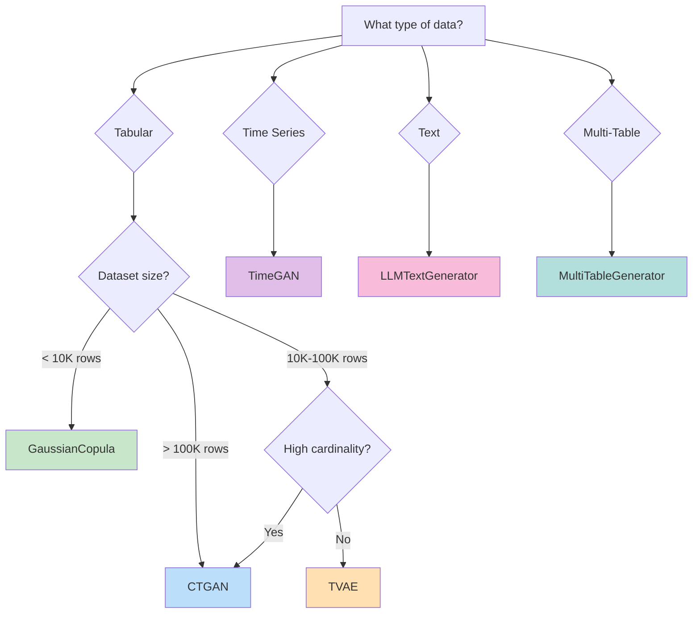

# Choosing a Generator

Genesis offers multiple synthetic data generators, each optimized for different scenarios. This guide helps you pick the right one.

## Quick Decision Tree



## Generator Comparison

| Generator | Best For | Speed | Quality | Privacy Support |
|-----------|----------|-------|---------|-----------------|
| **GaussianCopula** | Small datasets, quick prototyping | ⚡⚡⚡ | ⭐⭐⭐ | ✅ |
| **CTGAN** | Complex data, high cardinality | ⚡ | ⭐⭐⭐⭐⭐ | ✅ |
| **TVAE** | Balanced speed/quality | ⚡⚡ | ⭐⭐⭐⭐ | ✅ |
| **TimeGAN** | Sequential/temporal data | ⚡ | ⭐⭐⭐⭐ | ✅ |
| **LLMTextGenerator** | Free-form text | ⚡⚡ | ⭐⭐⭐⭐⭐ | ⚠️ |

## Let AutoML Decide

If you're unsure, use AutoML to automatically select the best method:

```python
from genesis import auto_synthesize

# Genesis analyzes your data and picks the best method
synthetic = auto_synthesize(df, n_samples=1000)
```

See what AutoML chose:

```python
from genesis.automl import AutoMLSynthesizer

automl = AutoMLSynthesizer()
automl.fit(df)

print(f"Selected: {automl.selected_method}")
print(f"Confidence: {automl.selection_confidence:.0%}")
print(f"Reason: {automl.selection_reason}")
```

## Gaussian Copula

**Best for:** Small to medium datasets, quick iteration, preserving correlations.

```python
from genesis import SyntheticGenerator

generator = SyntheticGenerator(method='gaussian_copula')
generator.fit(df, discrete_columns=['category', 'status'])
synthetic = generator.generate(1000)
```

**Pros:**
- Fastest training time
- Excellent correlation preservation
- Works well with small datasets

**Cons:**
- May struggle with complex distributions
- Limited handling of high-cardinality categories

## CTGAN (Conditional Tabular GAN)

**Best for:** Complex datasets, high cardinality categories, production quality.

```python
from genesis import SyntheticGenerator

generator = SyntheticGenerator(
    method='ctgan',
    config={
        'epochs': 300,
        'batch_size': 500,
        'generator_dim': (256, 256),
        'discriminator_dim': (256, 256)
    }
)
generator.fit(df, discrete_columns=['category', 'status'])
synthetic = generator.generate(1000)
```

**Pros:**
- Handles complex, multimodal distributions
- Excellent for high-cardinality categories
- State-of-the-art quality

**Cons:**
- Slower training
- Requires more data (ideally 10K+ rows)
- GPU recommended for large datasets

## TVAE (Tabular Variational Autoencoder)

**Best for:** Balanced speed/quality, medium-sized datasets.

```python
from genesis import SyntheticGenerator

generator = SyntheticGenerator(
    method='tvae',
    config={
        'epochs': 300,
        'batch_size': 500,
        'compress_dims': (128, 128),
        'decompress_dims': (128, 128)
    }
)
generator.fit(df, discrete_columns=['category'])
synthetic = generator.generate(1000)
```

**Pros:**
- More stable training than GAN
- Good balance of speed and quality
- Works well for medium datasets

**Cons:**
- May produce slightly less diverse outputs
- Still slower than statistical methods

## TimeGAN

**Best for:** Time series, sequential data, temporal patterns.

```python
from genesis.generators.timeseries import TimeGANGenerator

generator = TimeGANGenerator(
    seq_len=24,          # Sequence length
    n_features=5,        # Number of features
    hidden_dim=24,
    epochs=100
)

generator.fit(time_series_df)
synthetic = generator.generate(100)  # 100 sequences
```

**Use cases:**
- Stock prices
- Sensor data
- User activity logs
- Weather patterns

## LLM Text Generator

**Best for:** Free-form text, descriptions, reviews.

```python
from genesis.generators.text import LLMTextGenerator

generator = LLMTextGenerator(
    provider='openai',
    model='gpt-4o-mini',
    api_key='your-api-key'
)

synthetic_reviews = generator.generate(
    n_samples=100,
    prompt="Generate a realistic product review for an electronics item",
    constraints={'sentiment': 'positive', 'length': 'medium'}
)
```

## Multi-Table Generator

**Best for:** Relational databases, foreign key relationships.

```python
from genesis.multitable import MultiTableGenerator, RelationalSchema

# Define relationships
schema = RelationalSchema()
schema.add_table('customers', primary_key='customer_id')
schema.add_table('orders', primary_key='order_id')
schema.add_relationship('orders', 'customer_id', 'customers', 'customer_id')

# Generate
generator = MultiTableGenerator(schema=schema)
generator.fit({
    'customers': customers_df,
    'orders': orders_df
})

synthetic_db = generator.generate(n_samples={'customers': 1000, 'orders': 5000})
```

## Domain-Specific Generators

For industry-specific data with realistic constraints:

```python
from genesis.domains import HealthcareGenerator, FinanceGenerator, RetailGenerator

# Healthcare with HIPAA-safe defaults
healthcare = HealthcareGenerator()
patients = healthcare.generate_patient_cohort(1000)

# Finance with fraud patterns
finance = FinanceGenerator()
transactions = finance.generate_transactions(10000, include_fraud=True)

# Retail with realistic purchasing patterns
retail = RetailGenerator()
orders = retail.generate_orders(5000)
```

## Performance Benchmarks

Tested on a dataset with 100K rows, 20 columns (MacBook Pro M1):

| Generator | Training Time | Quality Score |
|-----------|--------------|---------------|
| GaussianCopula | 5 seconds | 87% |
| TVAE | 3 minutes | 92% |
| CTGAN | 8 minutes | 95% |
| CTGAN (GPU) | 45 seconds | 95% |

## Next Steps

- **[AutoML Guide](/docs/guides/automl)** - Automatic method selection
- **[Tabular Data Guide](/docs/guides/tabular-data)** - Deep dive into tabular generation
- **[Time Series Guide](/docs/guides/time-series)** - Sequential data generation
- **[Privacy Configuration](/docs/concepts/privacy)** - Add privacy guarantees
