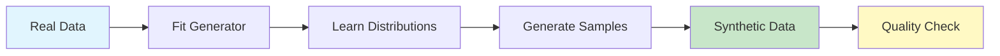

# Quick Start

Generate your first privacy-safe synthetic dataset in under 5 minutes.

## Prerequisites

```bash
pip install genesis-synth[pytorch]
```

## Step 1: Prepare Your Data

Start with any pandas DataFrame:

```python
import pandas as pd

# Your real data (or load from CSV)
real_data = pd.DataFrame({
    'customer_id': range(1, 1001),
    'age': [25 + i % 50 for i in range(1000)],
    'income': [40000 + i * 100 for i in range(1000)],
    'city': ['New York', 'Los Angeles', 'Chicago', 'Houston', 'Phoenix'] * 200,
    'is_premium': [i % 3 == 0 for i in range(1000)]
})

print(f"Real data: {len(real_data)} rows, {len(real_data.columns)} columns")
```

## Step 2: Generate Synthetic Data

### Option A: AutoML (Recommended)

Let Genesis automatically choose the best method:

```python
from genesis import auto_synthesize

# One line - Genesis picks the best method for your data
synthetic_data = auto_synthesize(real_data, n_samples=1000)

print(f"Generated: {len(synthetic_data)} synthetic rows")
print(synthetic_data.head())
```

### Option B: Manual Control

Choose a specific generator:

```python
from genesis import SyntheticGenerator

# Create and train the generator
generator = SyntheticGenerator(method='ctgan')
generator.fit(real_data, discrete_columns=['city', 'is_premium'])

# Generate synthetic data
synthetic_data = generator.generate(n_samples=1000)
```

## Step 3: Evaluate Quality

Verify your synthetic data maintains statistical properties:

```python
from genesis import QualityEvaluator

evaluator = QualityEvaluator(real_data, synthetic_data)
report = evaluator.evaluate()

print(f"Overall Quality: {report.overall_score:.1%}")
print(f"Statistical Fidelity: {report.fidelity_score:.1%}")
print(f"ML Utility: {report.utility_score:.1%}")
print(f"Privacy Score: {report.privacy_score:.1%}")
```

Expected output:
```
Overall Quality: 94.2%
Statistical Fidelity: 93.8%
ML Utility: 95.1%
Privacy Score: 99.2%
```

## Step 4: Save Your Data

```python
# Save to CSV
synthetic_data.to_csv('synthetic_customers.csv', index=False)

# Or Parquet for better performance
synthetic_data.to_parquet('synthetic_customers.parquet', index=False)
```

## Complete Example

Here's everything together:

```python
import pandas as pd
from genesis import auto_synthesize, QualityEvaluator

# 1. Load or create your data
real_data = pd.read_csv('customers.csv')

# 2. Generate synthetic data (AutoML selects best method)
synthetic_data = auto_synthesize(
    real_data,
    n_samples=len(real_data),  # Same size as original
    prefer_quality=True         # Optimize for quality over speed
)

# 3. Evaluate quality
evaluator = QualityEvaluator(real_data, synthetic_data)
report = evaluator.evaluate()
print(report.summary())

# 4. Save
synthetic_data.to_csv('synthetic_customers.csv', index=False)
print(f"✓ Generated {len(synthetic_data)} synthetic records")
```

## Using the CLI

Genesis also provides a command-line interface:

```bash
# Generate synthetic data
genesis generate -i customers.csv -o synthetic.csv -n 1000

# With AutoML
genesis automl -i customers.csv -o synthetic.csv -n 1000

# Evaluate quality
genesis evaluate -r customers.csv -s synthetic.csv -o report.html
```

## What's Happening Under the Hood



1. **Fit**: The generator analyzes your data's statistical properties
2. **Learn**: It builds a model of distributions and correlations
3. **Generate**: New samples are drawn from the learned model
4. **Validate**: Quality metrics ensure the synthetic data is realistic

## Next Steps

Now that you've generated your first dataset:

- **[Choose Your Generator](/docs/getting-started/first-generator)** - Learn when to use CTGAN vs TVAE vs others
- **[Core Concepts](/docs/concepts/overview)** - Understand how synthetic data generation works
- **[Add Privacy](/docs/concepts/privacy)** - Configure differential privacy and k-anonymity
- **[AutoML Guide](/docs/guides/automl)** - Learn about automatic method selection
