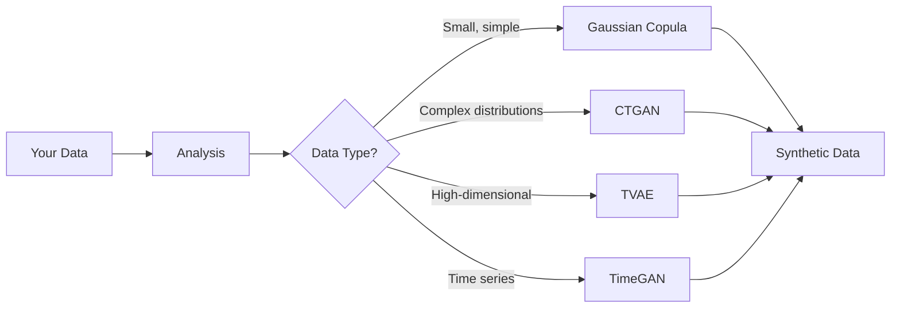

# AutoML Synthesis

Let Genesis automatically select the best generation method for your data.

## Quick Start

```python
from genesis import auto_synthesize
import pandas as pd

# Load your data
df = pd.read_csv('customers.csv')

# AutoML handles everything
synthetic = auto_synthesize(df, n_samples=1000)
```

That's it! Genesis analyzes your data and picks the optimal method.

## How It Works



The AutoML system:
1. Analyzes dataset characteristics (size, types, distributions)
2. Scores candidate methods
3. Selects the best fit
4. Trains and generates

## Configuration

### Quality vs Speed

```python
# Quick generation (lower quality)
synthetic = auto_synthesize(df, n_samples=1000, mode='fast')

# Balanced (default)
synthetic = auto_synthesize(df, n_samples=1000, mode='balanced')

# Maximum quality (slower)
synthetic = auto_synthesize(df, n_samples=1000, mode='quality')
```

### Explicit Constraints

```python
synthetic = auto_synthesize(
    df,
    n_samples=1000,
    discrete_columns=['category', 'status'],
    constraints=[
        Constraint.positive('age'),
        Constraint.range('rating', 1, 5)
    ]
)
```

### Privacy Settings

```python
synthetic = auto_synthesize(
    df,
    n_samples=1000,
    privacy={
        'differential_privacy': {'epsilon': 1.0},
        'k_anonymity': {'k': 5}
    }
)
```

## Method Selection Logic

### Dataset Size

| Rows | Columns | Recommended |
|------|---------|-------------|
| < 1,000 | < 20 | Gaussian Copula |
| < 1,000 | ≥ 20 | TVAE |
| ≥ 1,000 | < 50 | CTGAN |
| ≥ 1,000 | ≥ 50 | TVAE |
| ≥ 100,000 | Any | Batch CTGAN |

### Data Characteristics

```python
# High cardinality categories -> CTGAN
# Many numeric columns -> TVAE
# Simple distributions -> Gaussian Copula
# Temporal data -> TimeGAN
```

## Getting the Recommendation

Preview what AutoML would choose:

```python
from genesis.automl import AutoMLSynthesizer

auto = AutoMLSynthesizer()
recommendation = auto.analyze(df)

print(f"Recommended method: {recommendation.method}")
print(f"Confidence: {recommendation.confidence:.1%}")
print(f"Reason: {recommendation.reason}")
```

Output:
```
Recommended method: ctgan
Confidence: 87.2%
Reason: Complex distributions with mixed types (15 numeric, 8 categorical)
```

## Override Recommendations

```python
from genesis.automl import AutoMLSynthesizer

auto = AutoMLSynthesizer()
auto.fit(df)

# Use recommended method
synthetic = auto.generate(1000)

# Or override
synthetic = auto.generate(1000, method='tvae')
```

## Hyperparameter Tuning

Enable automatic hyperparameter search:

```python
synthetic = auto_synthesize(
    df,
    n_samples=1000,
    tune_hyperparameters=True,
    tuning_budget=60  # seconds
)
```

## Method Comparison

Compare all methods on your data:

```python
from genesis.automl import compare_methods

results = compare_methods(df, methods=['ctgan', 'tvae', 'gaussian_copula'])

for method, metrics in results.items():
    print(f"{method}:")
    print(f"  Quality: {metrics['quality']:.1%}")
    print(f"  Speed: {metrics['time']:.1f}s")
    print(f"  Privacy: {metrics['privacy']:.1%}")
```

## Evaluation Report

Get detailed quality metrics:

```python
synthetic, report = auto_synthesize(
    df,
    n_samples=1000,
    return_report=True
)

print(report.summary())
print(f"Method used: {report.method}")
print(f"Training time: {report.training_time:.1f}s")
print(f"Quality score: {report.quality_score:.1%}")
```

## Complete Example

```python
import pandas as pd
from genesis import auto_synthesize, Constraint

# Load data
df = pd.read_csv('ecommerce_transactions.csv')

# Auto-generate with constraints
synthetic, report = auto_synthesize(
    df,
    n_samples=len(df),
    discrete_columns=['category', 'payment_method', 'region'],
    constraints=[
        Constraint.positive('amount'),
        Constraint.positive('quantity'),
        Constraint.range('rating', 1, 5)
    ],
    privacy={'differential_privacy': {'epsilon': 1.0}},
    mode='quality',
    return_report=True
)

# Review results
print(f"Method: {report.method}")
print(f"Quality: {report.quality_score:.1%}")
print(f"Privacy: {report.privacy_score:.1%}")

# Save
synthetic.to_csv('synthetic_transactions.csv', index=False)
report.save('synthesis_report.html')
```

## CLI Usage

```bash
# AutoML from command line
genesis automl data.csv --output synthetic.csv --samples 1000

# With options
genesis automl data.csv \
  --output synthetic.csv \
  --samples 1000 \
  --mode quality \
  --discrete-columns category,status
```

## Best Practices

1. **Start with AutoML** - Good default for unfamiliar data
2. **Review recommendations** - Understand why methods are chosen
3. **Override when needed** - Domain knowledge can beat auto-selection
4. **Use quality mode for production** - Extra time is worth it
5. **Compare methods for critical use cases** - Verify auto-selection

## When Not to Use AutoML

- Very large datasets (>1M rows) - Manual tuning more efficient
- Real-time generation needs - Pre-select method
- Well-understood data - Skip analysis overhead
- Specific method requirements - Use direct API

## Next Steps

- **[Evaluation](/docs/concepts/evaluation)** - Understanding quality metrics
- **[Generators](/docs/concepts/generators)** - Manual method selection
- **[Pipelines](/docs/guides/pipelines)** - Integrate AutoML in workflows
